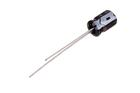
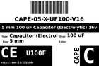

Contents
========

* [CEU100F > 5 mm 100 uF Capacitor (Electrolytic) 16v](#ceu100f--5-mm-100-uf-capacitor-electrolytic-16v)
	* [Images](#images)
	* [Datasheets](#datasheets)
	* [Labels](#labels)
	* [EDA](#eda)
	* [Tags](#tags)
  
![][im]
# CEU100F > 5 mm 100 uF Capacitor (Electrolytic) 16v

- ID: CAPE-05-X-UF100-V16
- Hex ID: CEU100F
- Name: 5 mm 100 uF Capacitor (Electrolytic) 16v
- Description: 5 mm 100 uF Capacitor (Electrolytic) 16v

## Images
  
  

|image|image_RE|label-front|label-inventory|label-spec|
| :---: | :---: | :---: | :---: | :---: |
||||||

## Datasheets

- Datasheet: [datasheet.pdf](datasheet.pdf)

## Labels
  
  

|label-front|label-inventory|label-spec|
| :---: | :---: | :---: |
||||

## EDA

### Symbols

## Tags

- oompID: CAPE-05-X-UF100-V16
- name: 5 mm 100 uF Capacitor (Electrolytic) 16v
- hexID: CEU100F
- oompSort: 
- oompType: CAPE
- oompSize: 05
- oompColor: X
- oompDesc: UF100
- oompIndex: V16
- oompVersion: 99
- oompClass: Surface Mount
- oompClassCode: SMDS
- ooNumPins: 2
- oompSchem: template;CAPE-XXXX-X-XXXX-XX-schem
- ooDesignator: C1

[im]: image_450.jpg
