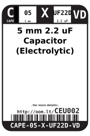
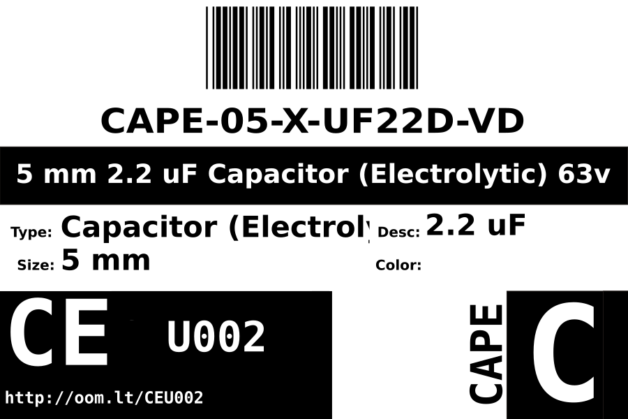
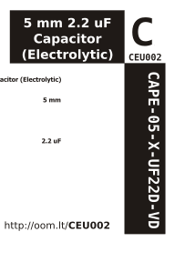

Contents
========

* [CAPE-05-X-UF22D-VD>5 mm 2.2 uF Capacitor (Electrolytic)](#cape-05-x-uf22d-vd5-mm-22-uf-capacitor-electrolytic)
	* [Datasheets](#datasheets)
	* [Labels](#labels)
	* [EDA](#eda)
		* [Symbols](#symbols)
	* [Tags](#tags)

# CAPE-05-X-UF22D-VD>5 mm 2.2 uF Capacitor (Electrolytic)

- ID: CAPE-05-X-UF22D-VD
- Name: CAPE-05-X-UF22D-VD

## Datasheets

- Datasheet: [datasheet.pdf](datasheet.pdf)

## Labels
  
  

|Front|Inventory|Specifications|
| :---: | :---: | :---: |
||||

## EDA

### Symbols

## Tags

- hexID: CEU002
- oompSort: 0.00000022000000
- oompType: CAPE
- oompSize: 05
- oompColor: X
- oompDesc: UF22D
- oompIndex: VD
- oompVersion: 99
- ooPitch: 2 mm
- ooHeight: 11 mm
- ooDiameter: 5 mm
- oompClass: Through Hole Component
- oompClassCode: THTH
- oompSchem: template;CAPE-XXXX-X-XXXX-XX-schem
- ooDesignator: C1
