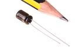
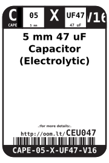
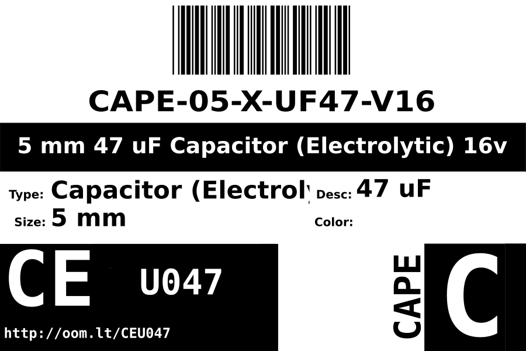
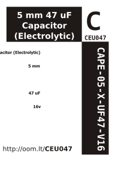

Contents
========

* [CAPE-05-X-UF47-V16>5 mm 47 uF Capacitor (Electrolytic) 16v](#cape-05-x-uf47-v165-mm-47-uf-capacitor-electrolytic-16v)
	* [Images](#images)
	* [Datasheets](#datasheets)
	* [Labels](#labels)
	* [EDA](#eda)
		* [Symbols](#symbols)
	* [Tags](#tags)
  
![][im]
# CAPE-05-X-UF47-V16>5 mm 47 uF Capacitor (Electrolytic) 16v

- ID: CAPE-05-X-UF47-V16
- Name: CAPE-05-X-UF47-V16

## Images
  
  

|image|image_RE|
| :---: | :---: |
|||

## Datasheets

- Datasheet: [datasheet.pdf](datasheet.pdf)

## Labels
  
  

|label-front|label-inventory|label-spec|
| :---: | :---: | :---: |
||||

## EDA

### Symbols

## Tags

- oompID: CAPE-05-X-UF47-V16
- name: 5 mm 47 uF Capacitor (Electrolytic) 16v
- hexID: CEU047
- oompSort: CAPE05UF47
- oompType: CAPE
- oompSize: 05
- oompColor: X
- oompDesc: UF47
- oompIndex: V16
- oompVersion: 98
- oompSchem: template;CAPE-XXXX-X-XXXX-XX-schem
- ooDesignator: C1

[im]: image_600.jpg
