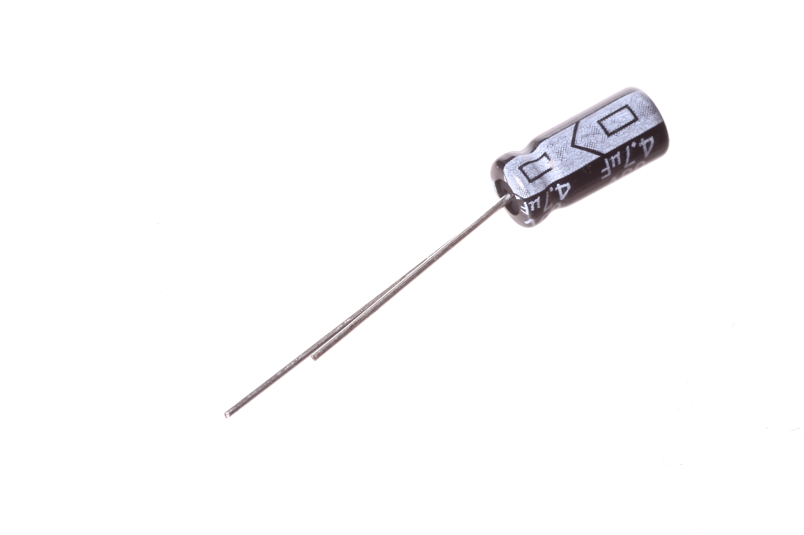
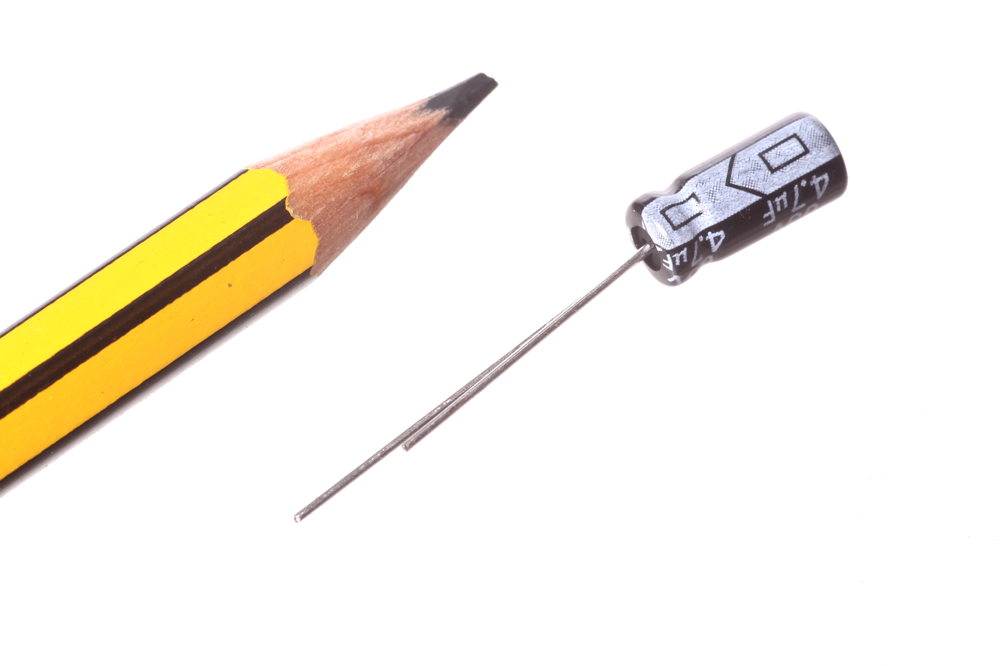

Contents
========

* [CAPE-05-X-UF47D-V63D>5 mm 4.7 uF Capacitor (Electrolytic) 63v](#cape-05-x-uf47d-v63d5-mm-47-uf-capacitor-electrolytic-63v)
	* [Images](#images)
	* [Datasheets](#datasheets)
	* [EDA](#eda)
		* [Footprints](#footprints)
		* [Symbols](#symbols)
	* [Tags](#tags)
  
![][im]
# CAPE-05-X-UF47D-V63D>5 mm 4.7 uF Capacitor (Electrolytic) 63v

- ID: CAPE-05-X-UF47D-V63D
- Name: CAPE-05-X-UF47D-V63D

## Images
  
  

|Main|Reference|
| :---: | :---: |
|||

## Datasheets

- Datasheet: [datasheet.pdf](datasheet.pdf)

## EDA

### Footprints
  

|||||
| :---: | :---: | :---: | :---: |

### Symbols

## Tags

- index: 104
- index: 9876
- oompID: CAPE-05-X-UF47D-V63D
- name: 5 mm 4.7 uF Capacitor (Electrolytic) 63v
- hexID: CEU004
- oompSort: 0.00000047000000
- oompType: CAPE
- oompSize: 05
- oompColor: X
- oompDesc: UF47D
- oompIndex: V63D
- oompVersion: 99
- ooPitch: 2 mm
- ooHeight: 11 mm
- ooDiameter: 5 mm
- oompClass: Through Hole Component
- oompClassCode: THTH
- oompSchem: template;CAPE-XXXX-X-XXXX-XX-schem
- ooDesignator: C1

[im]: image_600.jpg
