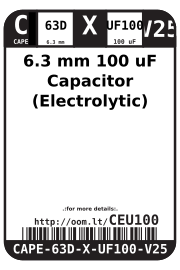
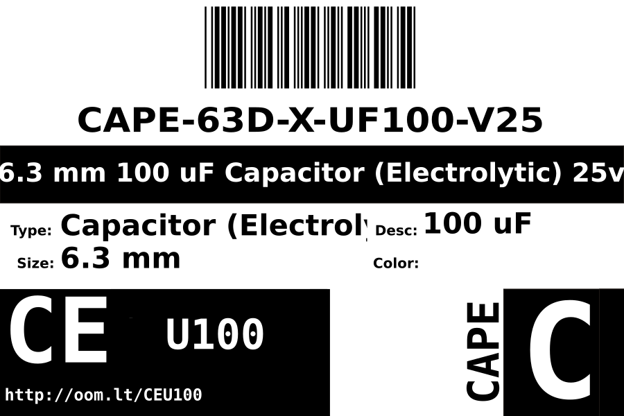

Contents
========

* [CAPE-63D-X-UF100-V25>6.3 mm 100 uF Capacitor (Electrolytic) 25v](#cape-63d-x-uf100-v2563-mm-100-uf-capacitor-electrolytic-25v)
	* [Images](#images)
	* [Datasheets](#datasheets)
	* [Labels](#labels)
	* [EDA](#eda)
		* [Symbols](#symbols)
	* [Tags](#tags)
  
![][im]
# CAPE-63D-X-UF100-V25>6.3 mm 100 uF Capacitor (Electrolytic) 25v

- ID: CAPE-63D-X-UF100-V25
- Name: CAPE-63D-X-UF100-V25

## Images
  
  

|image|image_RE|
| :---: | :---: |
|||

## Datasheets

- Datasheet: [datasheet.pdf](datasheet.pdf)

## Labels
  
  

|label-front|label-inventory|label-spec|
| :---: | :---: | :---: |
||||

## EDA

### Symbols

## Tags

- oompID: CAPE-63D-X-UF100-V25
- name: 6.3 mm 100 uF Capacitor (Electrolytic) 25v
- hexID: CEU100
- oompSort: THTH0.00001000000000
- oompType: CAPE
- oompSize: 63D
- oompColor: X
- oompDesc: UF100
- oompIndex: V25
- oompVersion: 99
- ooPitch: 2.5 mm
- ooHeight: 11 mm
- ooDiameter: 6.3 mm
- oompClass: Through Hole Component
- oompClassCode: THTH
- oompSchem: template;CAPE-XXXX-X-XXXX-XX-schem
- ooDesignator: C1

[im]: image_600.jpg
