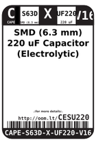
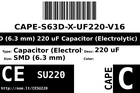
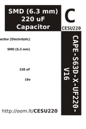
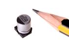
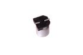

Contents
========

* [CESU220 > ](#cesu220--)
	* [Datasheets](#datasheets)
	* [Labels](#labels)
	* [EDA](#eda)
	* [Images](#images)
	* [Tags](#tags)
  
![][im]
# CESU220 > 

- ID: CAPE-PAND-X-UF220-V16
- Hex ID: CESU220
- Name: 
- Description: 
- Long Link: [http://oom.lt/CAPE-PAND-X-UF220-V16](http://oom.lt/CAPE-PAND-X-UF220-V16)
- Short Link: [http://oom.lt/CESU220](http://oom.lt/CESU220)

## Datasheets

- Datasheet: [datasheet.pdf](datasheet.pdf)

## Labels
  
  

|label-front|label-inventory|label-spec|
| :---: | :---: | :---: |
||||

## EDA

## Images
  
  

|image|image_RE|image_BOTTOM|label-front|label-inventory|label-spec|
| :---: | :---: | :---: | :---: | :---: | :---: |
|||||||

## Tags

- hexID: CESU220
- oompType: CAPE
- oompSize: PAND
- oompColor: X
- oompDesc: UF220
- oompIndex: V16
- oompVersion: 98
- oompSchem: template;CAPE-XXXX-X-XXXX-XX-schem
- ooDesignator: C1
- oompID: CAPE-PAND-X-UF220-V16

[im]: image_450.jpg
