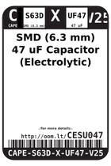
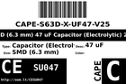
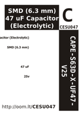
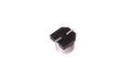

Contents
========

* [CESU047 > SMD (6.3 mm) (Panasonic D) 47 uF Capacitor (Electrolytic) 25v](#cesu047--smd-63-mm-panasonic-d-47-uf-capacitor-electrolytic-25v)
	* [Datasheets](#datasheets)
	* [Labels](#labels)
	* [EDA](#eda)
	* [Images](#images)
	* [Tags](#tags)
  
![][im]
# CESU047 > SMD (6.3 mm) (Panasonic D) 47 uF Capacitor (Electrolytic) 25v

- ID: CAPE-PAND-X-UF47-V25
- Hex ID: CESU047
- Name: SMD (6.3 mm) (Panasonic D) 47 uF Capacitor (Electrolytic) 25v
- Description: SMD (6.3 mm) (Panasonic D) 47 uF Capacitor (Electrolytic) 25v
- Long Link: [http://oom.lt/CAPE-PAND-X-UF47-V25](http://oom.lt/CAPE-PAND-X-UF47-V25)
- Short Link: [http://oom.lt/CESU047](http://oom.lt/CESU047)

## Datasheets

- Datasheet: [datasheet.pdf](datasheet.pdf)

## Labels
  
  

|label-front|label-inventory|label-spec|
| :---: | :---: | :---: |
||||

## EDA

### Instances
  
  
Used 6 times.  
Prevalance: (6\9905) 0.0606%  

|OOMP Instances|
| :---: |
|[PROJ-ADAF-2466-STAN-01  Adafruit METRO 328 PCB  Used 1 times. PC1](https://github.com/oomlout/oomlout_OOMP_projects/tree/main/PROJ-ADAF-2466-STAN-01/)|
|[PROJ-ADAF-3382-STAN-01  Adafruit Metro M4 Express PCB  Used 1 times. PC1](https://github.com/oomlout/oomlout_OOMP_projects/tree/main/PROJ-ADAF-3382-STAN-01/)|
|[PROJ-ADAF-3505-STAN-01  Adafruit Metro M0 Express PCB  Used 1 times. PC1](https://github.com/oomlout/oomlout_OOMP_projects/tree/main/PROJ-ADAF-3505-STAN-01/)|
|[PROJ-ADAF-4000-STAN-01  Adafruit Metro M4 Express AirLift PCB  Used 1 times. PC1](https://github.com/oomlout/oomlout_OOMP_projects/tree/main/PROJ-ADAF-4000-STAN-01/)|
|[PROJ-ADAF-4064-STAN-01  Adafruit Grand Central PCB  Used 1 times. PC1](https://github.com/oomlout/oomlout_OOMP_projects/tree/main/PROJ-ADAF-4064-STAN-01/)|
|[PROJ-ADAF-4775-STAN-01  Adafruit Metro ESP32 S2 PCB  Used 1 times. PC1](https://github.com/oomlout/oomlout_OOMP_projects/tree/main/PROJ-ADAF-4775-STAN-01/)|

### Symbols

## Images
  
  

|image|image_BOTTOM|label-front|label-inventory|label-spec|
| :---: | :---: | :---: | :---: | :---: |
||||||

## Tags

- hexID: CESU047
- oompType: CAPE
- oompSize: PAND
- oompColor: X
- oompDesc: UF47
- oompIndex: V25
- oompVersion: 99
- oompSkip: true
- ooWidth: 6.6
- ooHeight: 5.4
- ooDiameter: 6.3
- ooLength: 6.6
- ooMaxVoltage: 25 v
- ooTolerance: 20%
- oompClass: Surface Mount
- oompClassCode: SMDS
- oompSchem: template;CAPE-XXXX-X-XXXX-XX-schem
- ooDesignator: C1
- oompID: CAPE-PAND-X-UF47-V25
- oompInstances: {'PROJECT': 'PROJ-ADAF-2466-STAN-01', 'ID': 'PC1'}
- oompInstances: {'PROJECT': 'PROJ-ADAF-3382-STAN-01', 'ID': 'PC1'}
- oompInstances: {'PROJECT': 'PROJ-ADAF-3505-STAN-01', 'ID': 'PC1'}
- oompInstances: {'PROJECT': 'PROJ-ADAF-4000-STAN-01', 'ID': 'PC1'}
- oompInstances: {'PROJECT': 'PROJ-ADAF-4064-STAN-01', 'ID': 'PC1'}
- oompInstances: {'PROJECT': 'PROJ-ADAF-4775-STAN-01', 'ID': 'PC1'}

[im]: image_450.jpg
