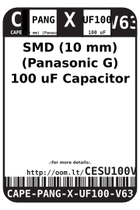
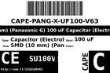
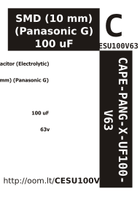

Contents
========

* [CESU100V63 > ](#cesu100v63--)
	* [Labels](#labels)
	* [EDA](#eda)
	* [Images](#images)
	* [Tags](#tags)

# CESU100V63 > 

- ID: CAPE-PANG-X-UF100-V63
- Hex ID: CESU100V63
- Name: 
- Description: 
- Long Link: [http://oom.lt/CAPE-PANG-X-UF100-V63](http://oom.lt/CAPE-PANG-X-UF100-V63)
- Short Link: [http://oom.lt/CESU100V63](http://oom.lt/CESU100V63)

## Labels
  
  

|label-front|label-inventory|label-spec|
| :---: | :---: | :---: |
||||

## EDA

## Images
  
  

|label-front|label-inventory|label-spec|
| :---: | :---: | :---: |
||||

## Tags

- oompType: CAPE
- oompSize: PANG
- oompColor: X
- oompDesc: UF100
- oompIndex: V63
- hexID: CESU100V63
- oompID: CAPE-PANG-X-UF100-V63
