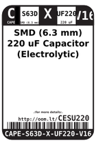
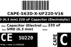
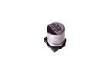
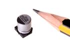
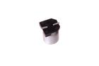

Contents
========

* [CESU220 > SMD (6.3 mm) 220 uF Capacitor (Electrolytic) 16v](#cesu220--smd-63-mm-220-uf-capacitor-electrolytic-16v)
	* [Datasheets](#datasheets)
	* [Labels](#labels)
	* [EDA](#eda)
	* [Images](#images)
	* [Tags](#tags)
  
![][im]
# CESU220 > SMD (6.3 mm) 220 uF Capacitor (Electrolytic) 16v

- ID: CAPE-S63D-X-UF220-V16
- Hex ID: CESU220
- Name: SMD (6.3 mm) 220 uF Capacitor (Electrolytic) 16v
- Description: SMD (6.3 mm) 220 uF Capacitor (Electrolytic) 16v
- Long Link: [http://oom.lt/CAPE-S63D-X-UF220-V16](http://oom.lt/CAPE-S63D-X-UF220-V16)
- Long Link: [http://oom.lt/CESU220](http://oom.lt/CESU220)

## Datasheets

- Datasheet: [datasheet.pdf](datasheet.pdf)

## Labels
  
  

|label-front|label-inventory|label-spec|
| :---: | :---: | :---: |
||||

## EDA

### Symbols

## Images
  
  

|image|image_RE|image_BOTTOM|label-front|label-inventory|label-spec|
| :---: | :---: | :---: | :---: | :---: | :---: |
|||||||

## Tags

- oompID: CAPE-S63D-X-UF220-V16
- name: SMD (6.3 mm) 220 uF Capacitor (Electrolytic) 16v
- hexID: CESU220
- oompSort: CAPES63DUF220
- oompType: CAPE
- oompSize: S63D
- oompColor: X
- oompDesc: UF220
- oompIndex: V16
- oompVersion: 98
- oompSchem: template;CAPE-XXXX-X-XXXX-XX-schem
- ooDesignator: C1

[im]: image_450.jpg
