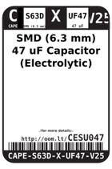
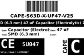

Contents
========

* [CESU047 > SMD (6.3 mm) 47 uF Capacitor (Electrolytic) 25v](#cesu047--smd-63-mm-47-uf-capacitor-electrolytic-25v)
	* [Datasheets](#datasheets)
	* [Labels](#labels)
	* [EDA](#eda)
	* [Images](#images)
	* [Tags](#tags)
  
![][im]
# CESU047 > SMD (6.3 mm) 47 uF Capacitor (Electrolytic) 25v

- ID: CAPE-S63D-X-UF47-V25
- Hex ID: CESU047
- Name: SMD (6.3 mm) 47 uF Capacitor (Electrolytic) 25v
- Description: SMD (6.3 mm) 47 uF Capacitor (Electrolytic) 25v
- Long Link: [http://oom.lt/CAPE-S63D-X-UF47-V25](http://oom.lt/CAPE-S63D-X-UF47-V25)
- Short Link: [http://oom.lt/CESU047](http://oom.lt/CESU047)

## Datasheets

- Datasheet: [datasheet.pdf](datasheet.pdf)

## Labels
  
  

|label-front|label-inventory|label-spec|
| :---: | :---: | :---: |
||||

## EDA

### Symbols

## Images
  
  

|image|image_BOTTOM|label-front|label-inventory|label-spec|
| :---: | :---: | :---: | :---: | :---: |
||||||

## Tags

- oompID: CAPE-S63D-X-UF47-V25
- name: SMD (6.3 mm) 47 uF Capacitor (Electrolytic) 25v
- hexID: CESU047
- oompSort: S63F0.00004700000000
- oompType: CAPE
- oompSize: S63D
- oompColor: X
- oompDesc: UF47
- oompIndex: V25
- oompVersion: 99
- oompSkip: true
- ooWidth: 6.6
- ooHeight: 5.4
- ooDiameter: 6.3
- ooLength: 6.6
- ooMaxVoltage: 25 v
- ooTolerance: 20%
- oompClass: Surface Mount
- oompClassCode: SMDS
- oompSchem: template;CAPE-XXXX-X-XXXX-XX-schem
- ooDesignator: C1

[im]: image_450.jpg
