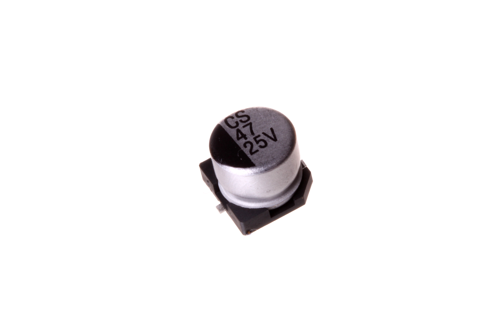
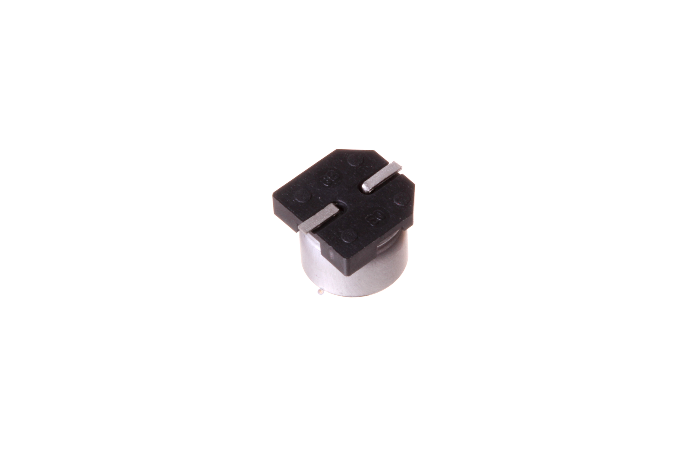

Contents
========

* [CAPE-S63D-X-UF47-V25>SMD (6.3 mm) 47 uF Capacitor (Electrolytic) 25v](#cape-s63d-x-uf47-v25smd-63-mm-47-uf-capacitor-electrolytic-25v)
	* [Images](#images)
	* [Datasheets](#datasheets)
	* [EDA](#eda)
		* [Footprints](#footprints)
		* [Symbols](#symbols)
	* [Tags](#tags)
  
![][im]
# CAPE-S63D-X-UF47-V25>SMD (6.3 mm) 47 uF Capacitor (Electrolytic) 25v

- ID: CAPE-S63D-X-UF47-V25
- Name: CAPE-S63D-X-UF47-V25

## Images
  
  

|Main|Bottom|
| :---: | :---: |
|||

## Datasheets

- Datasheet: [datasheet.pdf](datasheet.pdf)

## EDA

### Footprints
  

|||||
| :---: | :---: | :---: | :---: |

### Symbols

## Tags

- index: 108
- index: 9876
- oompID: CAPE-S63D-X-UF47-V25
- name: SMD (6.3 mm) 47 uF Capacitor (Electrolytic) 25v
- hexID: CESU047
- oompSort: S63F0.00004700000000
- oompType: CAPE
- oompSize: S63D
- oompColor: X
- oompDesc: UF47
- oompIndex: V25
- oompVersion: 99
- oompSkip: true
- ooWidth: 6.6
- ooHeight: 5.4
- ooDiameter: 6.3
- ooLength: 6.6
- ooMaxVoltage: 25 v
- ooTolerance: 20%
- oompClass: Surface Mount
- oompClassCode: SMDS
- oompSchem: template;CAPE-XXXX-X-XXXX-XX-schem
- ooDesignator: C1

[im]: image_600.jpg
