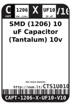
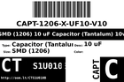
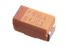

Contents
========

* [CTS1U010B > SMD (1206) 10 uF Capacitor (Tantalum) 10v](#cts1u010b--smd-1206-10-uf-capacitor-tantalum-10v)
	* [Datasheets](#datasheets)
	* [Labels](#labels)
	* [EDA](#eda)
	* [Images](#images)
	* [Tags](#tags)
  
![][im]
# CTS1U010B > SMD (1206) 10 uF Capacitor (Tantalum) 10v

- ID: CAPT-1206-X-UF10-V10
- Hex ID: CTS1U010B
- Name: SMD (1206) 10 uF Capacitor (Tantalum) 10v
- Description: SMD (1206) 10 uF Capacitor (Tantalum) 10v
- Long Link: [http://oom.lt/CAPT-1206-X-UF10-V10](http://oom.lt/CAPT-1206-X-UF10-V10)
- Long Link: [http://oom.lt/CTS1U010B](http://oom.lt/CTS1U010B)

## Datasheets

- Datasheet: [datasheet.pdf](datasheet.pdf)

## Labels
  
  

|label-front|label-inventory|label-spec|
| :---: | :---: | :---: |
||||

## EDA

### Symbols

## Images
  
  

|image|image_RE|image_BOTTOM|label-front|label-inventory|label-spec|
| :---: | :---: | :---: | :---: | :---: | :---: |
|||||||

## Tags

- oompID: CAPT-1206-X-UF10-V10
- name: SMD (1206) 10 uF Capacitor (Tantalum) 10v
- hexID: CTS1U010B
- oompSort: 12060.00000100000000
- oompType: CAPT
- oompSize: 1206
- oompColor: X
- oompDesc: UF10
- oompIndex: V10
- oompVersion: 99
- ooWidth: 1.6 mm
- ooLength: 3.2 mm
- ooManufacturer: AVX
- ooManufacturerPartNumber: TAJA106K010RNJ
- ooMaxVoltage: 10 V
- ooTolerance: 10%
- ooSEEEDsku: 0130040P1
- ooSEEEDdesc: SMD CAP Tantalum 10uF-10V 10%
- oompClass: Surface Mount
- oompClassCode: SMDS
- oompBbls: template;XXXX-1206-X-XXXX-XX-bbls
- oompDiag: template;XXXX-1206-X-XXXX-XX-diag
- oompIden: template;XXXX-1206-X-XXXX-XX-iden
- oompSchem: template;CAPT-XXXX-X-XXXX-XX-schem
- oompSimp: template;XXXX-1206-X-XXXX-XX-simp
- ooDesignator: C1

[im]: image_450.jpg
