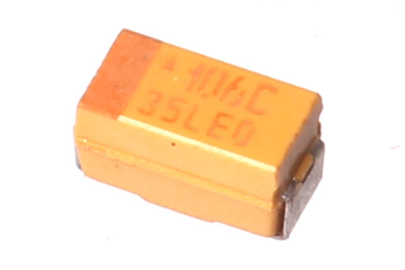
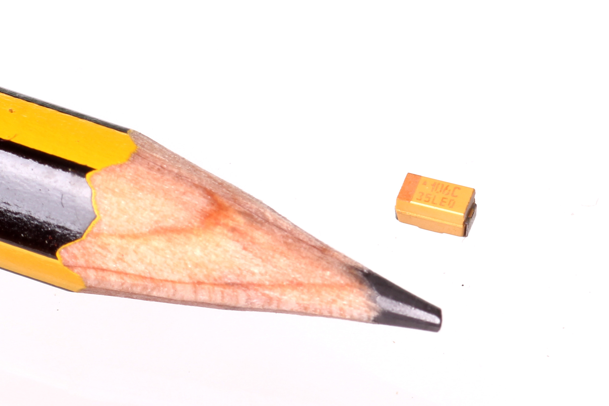
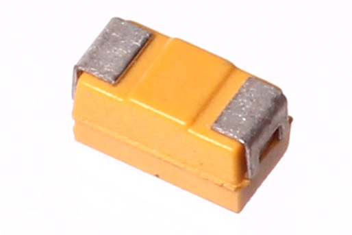

Contents
========

* [CAPT-1206-X-UF10-V16>SMD (1206) 10 uF Capacitor (Tantalum) 16v](#capt-1206-x-uf10-v16smd-1206-10-uf-capacitor-tantalum-16v)
	* [Images](#images)
	* [Datasheets](#datasheets)
	* [EDA](#eda)
		* [Footprints](#footprints)
		* [Symbols](#symbols)
	* [Tags](#tags)

# CAPT-1206-X-UF10-V16>SMD (1206) 10 uF Capacitor (Tantalum) 16v

- ID: CAPT-1206-X-UF10-V16
- Name: CAPT-1206-X-UF10-V16

## Images
  
  

|Main|Reference|Bottom|
| :---: | :---: | :---: |
||||

## Datasheets

- Datasheet: [datasheet.pdf](datasheet.pdf)

## EDA

### Footprints
  

|||||
| :---: | :---: | :---: | :---: |

### Symbols

## Tags

- index: 110
- index: 4273
- oompID: CAPT-1206-X-UF10-V16
- name: SMD (1206) 10 uF Capacitor (Tantalum) 16v
- hexID: CTS1U010F
- oompSort: 12060.00001000000000
- oompType: CAPT
- oompSize: 1206
- oompColor: X
- oompDesc: UF10
- oompIndex: V16
- oompVersion: 99
- oompClass: Surface Mount
- oompClassCode: SMDS
- oompBbls: template;XXXX-1206-X-XXXX-XX-bbls
- oompDiag: template;XXXX-1206-X-XXXX-XX-diag
- oompIden: template;XXXX-1206-X-XXXX-XX-iden
- oompSchem: template;CAPT-XXXX-X-XXXX-XX-schem
- oompSimp: template;XXXX-1206-X-XXXX-XX-simp
- ooDesignator: C1
