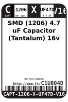
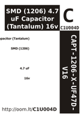

Contents
========

* [C1U004D > SMD (1206) 4.7 uF Capacitor (Tantalum) 16v](#c1u004d--smd-1206-47-uf-capacitor-tantalum-16v)
	* [Labels](#labels)
	* [EDA](#eda)
	* [Images](#images)
	* [Tags](#tags)

# C1U004D > SMD (1206) 4.7 uF Capacitor (Tantalum) 16v

- ID: CAPT-1206-X-UF47D-V16
- Hex ID: C1U004D
- Name: SMD (1206) 4.7 uF Capacitor (Tantalum) 16v
- Description: SMD (1206) 4.7 uF Capacitor (Tantalum) 16v
- Long Link: [http://oom.lt/CAPT-1206-X-UF47D-V16](http://oom.lt/CAPT-1206-X-UF47D-V16)
- Short Link: [http://oom.lt/C1U004D](http://oom.lt/C1U004D)

## Labels
  
  

|label-front|label-inventory|label-spec|
| :---: | :---: | :---: |
||||

## EDA

### Symbols

## Images
  
  

|label-front|label-inventory|label-spec|
| :---: | :---: | :---: |
||||

## Tags

- oompID: CAPT-1206-X-UF47D-V16
- name: SMD (1206) 4.7 uF Capacitor (Tantalum) 16v
- hexID: C1U004D
- oompSort: CAPT1206UF47D
- oompType: CAPT
- oompSize: 1206
- oompColor: X
- oompDesc: UF47D
- oompIndex: V16
- oompVersion: 98
- oompBbls: template;XXXX-1206-X-XXXX-XX-bbls
- oompDiag: template;XXXX-1206-X-XXXX-XX-diag
- oompIden: template;XXXX-1206-X-XXXX-XX-iden
- oompSchem: template;CAPT-XXXX-X-XXXX-XX-schem
- oompSimp: template;XXXX-1206-X-XXXX-XX-simp
- ooDesignator: C1
