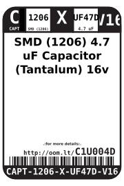
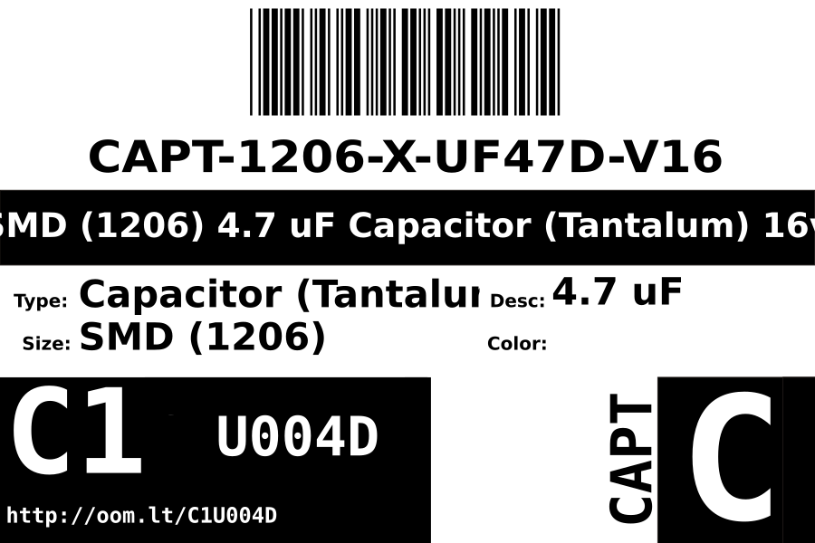
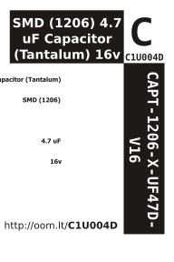

Contents
========

* [CAPT-1206-X-UF47D-V16>SMD (1206) 4.7 uF Capacitor (Tantalum) 16v](#capt-1206-x-uf47d-v16smd-1206-47-uf-capacitor-tantalum-16v)
	* [Datasheets](#datasheets)
	* [Labels](#labels)
	* [EDA](#eda)
		* [Symbols](#symbols)
	* [Tags](#tags)

# CAPT-1206-X-UF47D-V16>SMD (1206) 4.7 uF Capacitor (Tantalum) 16v

- ID: CAPT-1206-X-UF47D-V16
- Name: CAPT-1206-X-UF47D-V16

## Datasheets

- Datasheet: [datasheet.pdf](datasheet.pdf)

## Labels
  
  

|label-front|label-inventory|label-spec|
| :---: | :---: | :---: |
||||

## EDA

### Symbols

## Tags

- oompID: CAPT-1206-X-UF47D-V16
- name: SMD (1206) 4.7 uF Capacitor (Tantalum) 16v
- hexID: C1U004D
- oompSort: CAPT1206UF47D
- oompType: CAPT
- oompSize: 1206
- oompColor: X
- oompDesc: UF47D
- oompIndex: V16
- oompVersion: 98
- oompBbls: template;XXXX-1206-X-XXXX-XX-bbls
- oompDiag: template;XXXX-1206-X-XXXX-XX-diag
- oompIden: template;XXXX-1206-X-XXXX-XX-iden
- oompSchem: template;CAPT-XXXX-X-XXXX-XX-schem
- oompSimp: template;XXXX-1206-X-XXXX-XX-simp
- ooDesignator: C1
