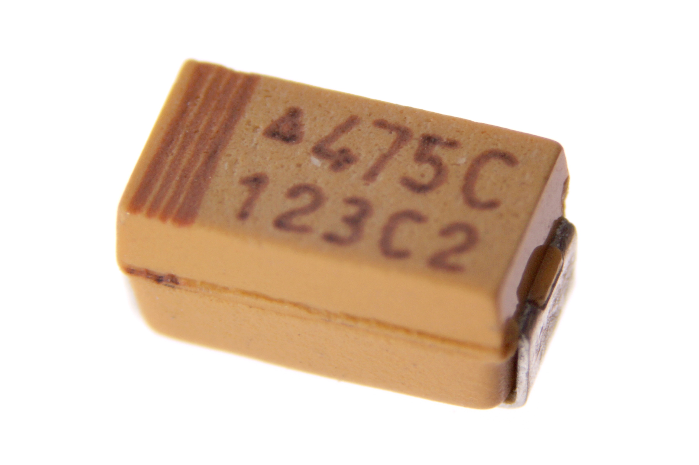

Contents
========

* [CAPT-1206-X-UF47D-V63D>SMD (1206) 4.7 uF Capacitor (Tantalum) 6.3v](#capt-1206-x-uf47d-v63dsmd-1206-47-uf-capacitor-tantalum-63v)
	* [Images](#images)
	* [Datasheets](#datasheets)
	* [EDA](#eda)
		* [Footprints](#footprints)
		* [Symbols](#symbols)
	* [Tags](#tags)

# CAPT-1206-X-UF47D-V63D>SMD (1206) 4.7 uF Capacitor (Tantalum) 6.3v

- ID: CAPT-1206-X-UF47D-V63D
- Name: CAPT-1206-X-UF47D-V63D

## Images
  
  

|Main|Bottom|
| :---: | :---: |
|||

## Datasheets

- Datasheet: [datasheet.pdf](datasheet.pdf)

## EDA

### Footprints
  

|||||
| :---: | :---: | :---: | :---: |

### Symbols

## Tags

- index: 113
- oompID: CAPT-1206-X-UF47D-V63D
- name: SMD (1206) 4.7 uF Capacitor (Tantalum) 6.3v
- hexID: CTS1U47DF
- oompSort: 
- oompClass: Surface Mount
- oompClassCode: SDMS
- oompType: CAPT
- oompSize: 1206
- oompColor: X
- oompDesc: UF47D
- oompIndex: V63D
- oompVersion: 99
- oompBbls: template;XXXX-1206-X-XXXX-XX-bbls
- oompDiag: template;XXXX-1206-X-XXXX-XX-diag
- oompIden: template;XXXX-1206-X-XXXX-XX-iden
- oompSchem: template;CAPT-XXXX-X-XXXX-XX-schem
- oompSimp: template;XXXX-1206-X-XXXX-XX-simp
- ooDesignator: C1
