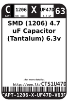
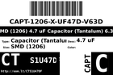
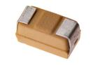

Contents
========

* [CTS1U47DF > SMD (1206) 4.7 uF Capacitor (Tantalum) 6.3v](#cts1u47df--smd-1206-47-uf-capacitor-tantalum-63v)
	* [Datasheets](#datasheets)
	* [Labels](#labels)
	* [EDA](#eda)
	* [Images](#images)
	* [Tags](#tags)
  
![][im]
# CTS1U47DF > SMD (1206) 4.7 uF Capacitor (Tantalum) 6.3v

- ID: CAPT-1206-X-UF47D-V63D
- Hex ID: CTS1U47DF
- Name: SMD (1206) 4.7 uF Capacitor (Tantalum) 6.3v
- Description: SMD (1206) 4.7 uF Capacitor (Tantalum) 6.3v
- Long Link: [http://oom.lt/CAPT-1206-X-UF47D-V63D](http://oom.lt/CAPT-1206-X-UF47D-V63D)
- Long Link: [http://oom.lt/CTS1U47DF](http://oom.lt/CTS1U47DF)

## Datasheets

- Datasheet: [datasheet.pdf](datasheet.pdf)

## Labels
  
  

|label-front|label-inventory|label-spec|
| :---: | :---: | :---: |
||||

## EDA

### Symbols

## Images
  
  

|image|image_BOTTOM|label-front|label-inventory|label-spec|
| :---: | :---: | :---: | :---: | :---: |
||||||

## Tags

- oompID: CAPT-1206-X-UF47D-V63D
- name: SMD (1206) 4.7 uF Capacitor (Tantalum) 6.3v
- hexID: CTS1U47DF
- oompSort: 
- oompClass: Surface Mount
- oompClassCode: SDMS
- oompType: CAPT
- oompSize: 1206
- oompColor: X
- oompDesc: UF47D
- oompIndex: V63D
- oompVersion: 99
- oompBbls: template;XXXX-1206-X-XXXX-XX-bbls
- oompDiag: template;XXXX-1206-X-XXXX-XX-diag
- oompIden: template;XXXX-1206-X-XXXX-XX-iden
- oompSchem: template;CAPT-XXXX-X-XXXX-XX-schem
- oompSimp: template;XXXX-1206-X-XXXX-XX-simp
- ooDesignator: C1

[im]: image_450.jpg
