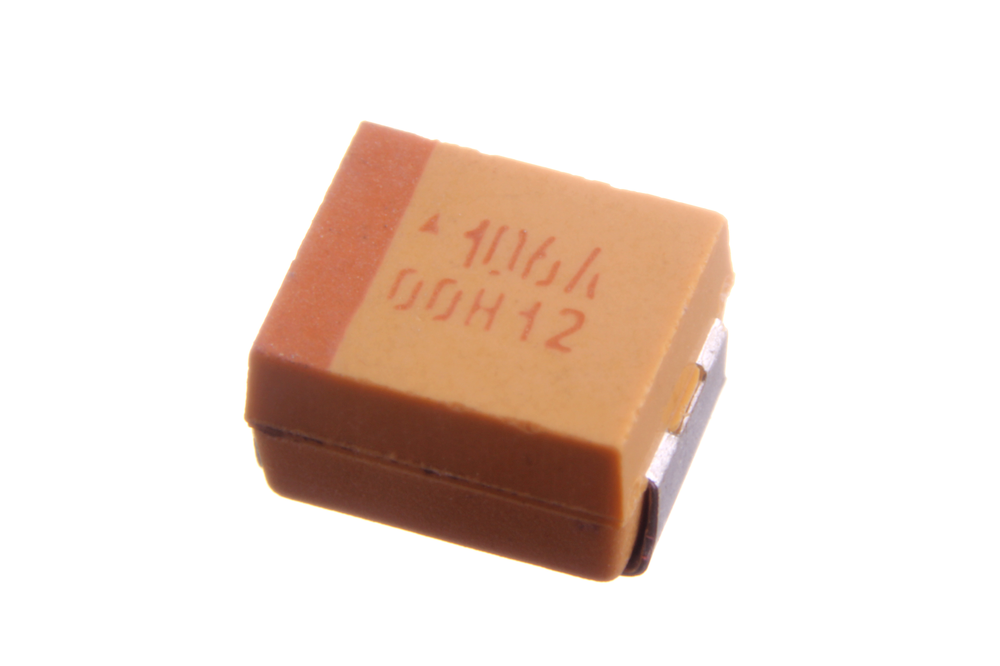
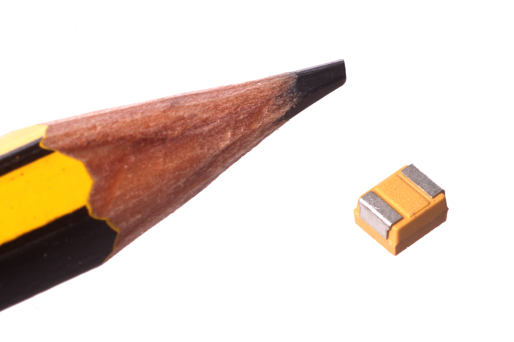
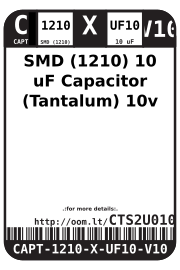
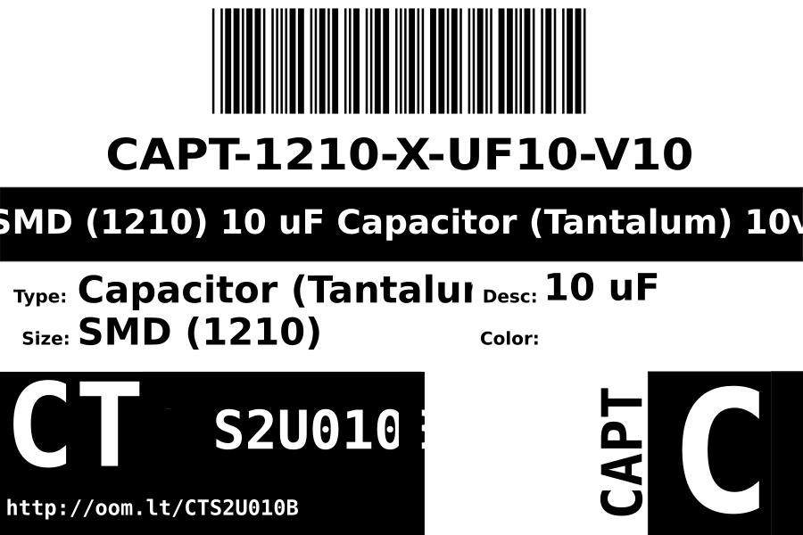
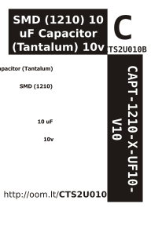

Contents
========

* [CAPT-1210-X-UF10-V10>SMD (1210) 10 uF Capacitor (Tantalum) 10v](#capt-1210-x-uf10-v10smd-1210-10-uf-capacitor-tantalum-10v)
	* [Images](#images)
	* [Datasheets](#datasheets)
	* [Labels](#labels)
	* [EDA](#eda)
		* [Symbols](#symbols)
	* [Tags](#tags)
  
![][im]
# CAPT-1210-X-UF10-V10>SMD (1210) 10 uF Capacitor (Tantalum) 10v

- ID: CAPT-1210-X-UF10-V10
- Name: CAPT-1210-X-UF10-V10

## Images
  
  

|Main|Reference|Bottom|
| :---: | :---: | :---: |
||||

## Datasheets

- Datasheet: [datasheet.pdf](datasheet.pdf)

## Labels
  
  

|Front|Inventory|Specifications|
| :---: | :---: | :---: |
||||

## EDA

### Symbols

## Tags

- index: 12413
- index: 4087
- oompID: CAPT-1210-X-UF10-V10
- name: SMD (1210) 10 uF Capacitor (Tantalum) 10v
- hexID: CTS2U010B
- oompSort: 12100.00001000000000
- oompType: CAPT
- oompSize: 1210
- oompColor: X
- oompDesc: UF10
- oompIndex: V10
- oompVersion: 99
- ooWidth: 2.80 mm
- ooLength: 3.50 mm
- ooManufacturer: AVX
- ooManufacturerPartNumber: TAJB106K010RNJ
- ooMaxVoltage: 10 V
- ooTolerance: 10%
- ooSEEEDsku: 302020019
- ooSEEEDdesc: SMD CAP Tantalum 10uF-10V 10%
- oompClass: Surface Mount
- oompClassCode: SMDS
- oompSchem: template;CAPT-XXXX-X-XXXX-XX-schem
- ooDesignator: C1

[im]: image_600.jpg
