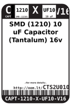
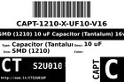
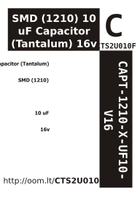
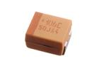
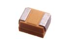

Contents
========

* [CTS2U010F > SMD (1210) 10 uF Capacitor (Tantalum) 16v](#cts2u010f--smd-1210-10-uf-capacitor-tantalum-16v)
	* [Datasheets](#datasheets)
	* [Labels](#labels)
	* [EDA](#eda)
	* [Images](#images)
	* [Tags](#tags)
  
![][im]
# CTS2U010F > SMD (1210) 10 uF Capacitor (Tantalum) 16v

- ID: CAPT-1210-X-UF10-V16
- Hex ID: CTS2U010F
- Name: SMD (1210) 10 uF Capacitor (Tantalum) 16v
- Description: SMD (1210) 10 uF Capacitor (Tantalum) 16v
- Long Link: [http://oom.lt/CAPT-1210-X-UF10-V16](http://oom.lt/CAPT-1210-X-UF10-V16)
- Long Link: [http://oom.lt/CTS2U010F](http://oom.lt/CTS2U010F)

## Datasheets

- Datasheet: [datasheet.pdf](datasheet.pdf)

## Labels
  
  

|label-front|label-inventory|label-spec|
| :---: | :---: | :---: |
||||

## EDA

### Symbols

## Images
  
  

|image|image_RE|image_BOTTOM|label-front|label-inventory|label-spec|
| :---: | :---: | :---: | :---: | :---: | :---: |
|||||||

## Tags

- oompID: CAPT-1210-X-UF10-V16
- name: SMD (1210) 10 uF Capacitor (Tantalum) 16v
- hexID: CTS2U010F
- oompSort: 12100.00000100000000
- oompType: CAPT
- oompSize: 1210
- oompColor: X
- oompDesc: UF10
- oompIndex: V16
- oompVersion: 99
- ooNumPins: 2
- ooFootprint: OOMP-CAPT-1206-*
- oompClass: Surface Mount
- oompClassCode: SMDS
- oompSchem: template;CAPT-XXXX-X-XXXX-XX-schem
- ooDesignator: C1

[im]: image_450.jpg
