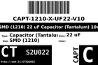
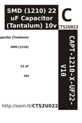

Contents
========

* [CTS2U022 > SMD (1210) 22 uF Capacitor (Tantalum) 10v](#cts2u022--smd-1210-22-uf-capacitor-tantalum-10v)
	* [Images](#images)
	* [Datasheets](#datasheets)
	* [Labels](#labels)
	* [EDA](#eda)
	* [Tags](#tags)
  
![][im]
# CTS2U022 > SMD (1210) 22 uF Capacitor (Tantalum) 10v

- ID: CAPT-1210-X-UF22-V10
- Hex ID: CTS2U022
- Name: SMD (1210) 22 uF Capacitor (Tantalum) 10v
- Description: SMD (1210) 22 uF Capacitor (Tantalum) 10v

## Images
  
  

|image|image_RE|image_BOTTOM|label-front|label-inventory|label-spec|
| :---: | :---: | :---: | :---: | :---: | :---: |
|||||||

## Datasheets

- Datasheet: [datasheet.pdf](datasheet.pdf)

## Labels
  
  

|label-front|label-inventory|label-spec|
| :---: | :---: | :---: |
||||

## EDA

### Symbols

## Tags

- oompID: CAPT-1210-X-UF22-V10
- name: SMD (1210) 22 uF Capacitor (Tantalum) 10v
- hexID: CTS2U022
- oompSort: 12100.00002200000000
- oompType: CAPT
- oompSize: 1210
- oompColor: X
- oompDesc: UF22
- oompIndex: V10
- oompVersion: 99
- ooWidth: 2.80 mm
- ooLength: 3.50 mm
- ooManufacturer: AVX
- ooManufacturerPartNumber: TAJB226K010RNJ
- ooMaxVoltage: 10 V
- ooTolerance: 10%
- ooSEEEDsku: 0130240P1
- ooSEEEDdesc: SMD CAP Tantalum 22uF-10V 10%
- oompClass: Surface Mount
- oompClassCode: SMDS
- oompSchem: template;CAPT-XXXX-X-XXXX-XX-schem
- ooDesignator: C1

[im]: image_450.jpg
