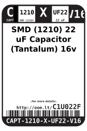
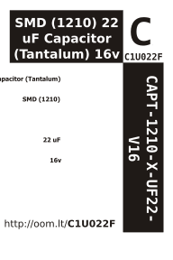

Contents
========

* [CAPT-1210-X-UF22-V16>SMD (1210) 22 uF Capacitor (Tantalum) 16v](#capt-1210-x-uf22-v16smd-1210-22-uf-capacitor-tantalum-16v)
	* [Datasheets](#datasheets)
	* [Labels](#labels)
	* [EDA](#eda)
		* [Symbols](#symbols)
	* [Tags](#tags)

# CAPT-1210-X-UF22-V16>SMD (1210) 22 uF Capacitor (Tantalum) 16v

- ID: CAPT-1210-X-UF22-V16
- Name: CAPT-1210-X-UF22-V16

## Datasheets

- Datasheet: [datasheet.pdf](datasheet.pdf)

## Labels
  
  

|label-front|label-inventory|label-spec|
| :---: | :---: | :---: |
||||

## EDA

### Symbols

## Tags

- oompID: CAPT-1210-X-UF22-V16
- name: SMD (1210) 22 uF Capacitor (Tantalum) 16v
- hexID: C1U022F
- oompSort: CAPT1210UF22
- oompType: CAPT
- oompSize: 1210
- oompColor: X
- oompDesc: UF22
- oompIndex: V16
- oompVersion: 98
- oompSchem: template;CAPT-XXXX-X-XXXX-XX-schem
- ooDesignator: C1
