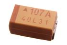
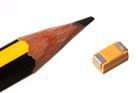
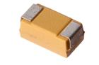
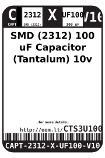
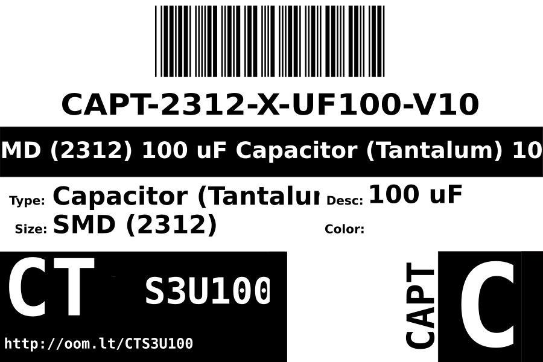
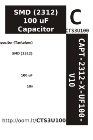

Contents
========

* [CAPT-2312-X-UF100-V10>SMD (2312) 100 uF Capacitor (Tantalum) 10v](#capt-2312-x-uf100-v10smd-2312-100-uf-capacitor-tantalum-10v)
	* [Images](#images)
	* [Datasheets](#datasheets)
	* [Labels](#labels)
	* [EDA](#eda)
		* [Symbols](#symbols)
	* [Tags](#tags)
  
![][im]
# CAPT-2312-X-UF100-V10>SMD (2312) 100 uF Capacitor (Tantalum) 10v

- ID: CAPT-2312-X-UF100-V10
- Name: CAPT-2312-X-UF100-V10

## Images
  
  

|image|image_RE|image_BOTTOM|
| :---: | :---: | :---: |
||||

## Datasheets

- Datasheet: [datasheet.pdf](datasheet.pdf)

## Labels
  
  

|label-front|label-inventory|label-spec|
| :---: | :---: | :---: |
||||

## EDA

### Symbols

## Tags

- oompID: CAPT-2312-X-UF100-V10
- name: SMD (2312) 100 uF Capacitor (Tantalum) 10v
- hexID: CTS3U100
- oompSort: 23120.00010000000000
- oompType: CAPT
- oompSize: 2312
- oompColor: X
- oompDesc: UF100
- oompIndex: V10
- oompVersion: 99
- ooWidth: 3.20 mm
- ooLength: 6.00 mm
- ooManufacturer: AVX
- ooManufacturerPartNumber: TAJC107K010RNJ
- ooMaxVoltage: 10 V
- ooTolerance: 10%
- ooSEEEDsku: 0130170P1
- ooSEEEDdesc: SMD CAP Tantalum 100uF-10V 10%
- oompClass: Surface Mount
- oompClassCode: SMDS
- oompSchem: template;CAPT-XXXX-X-XXXX-XX-schem
- ooDesignator: C1

[im]: image_600.jpg
