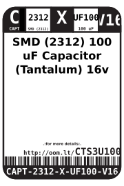
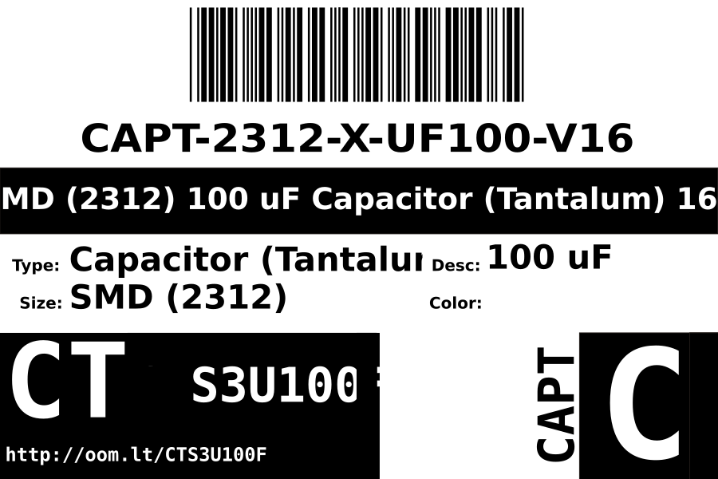

Contents
========

* [CAPT-2312-X-UF100-V16>SMD (2312) 100 uF Capacitor (Tantalum) 16v](#capt-2312-x-uf100-v16smd-2312-100-uf-capacitor-tantalum-16v)
	* [Datasheets](#datasheets)
	* [Labels](#labels)
	* [EDA](#eda)
		* [Symbols](#symbols)
	* [Tags](#tags)

# CAPT-2312-X-UF100-V16>SMD (2312) 100 uF Capacitor (Tantalum) 16v

- ID: CAPT-2312-X-UF100-V16
- Name: CAPT-2312-X-UF100-V16

## Datasheets

- Datasheet: [datasheet.pdf](datasheet.pdf)

## Labels
  
  

|label-front|label-inventory|label-spec|
| :---: | :---: | :---: |
||||

## EDA

### Symbols

## Tags

- oompID: CAPT-2312-X-UF100-V16
- name: SMD (2312) 100 uF Capacitor (Tantalum) 16v
- hexID: CTS3U100F
- oompSort: CAPC2312UF100
- oompType: CAPT
- oompSize: 2312
- oompColor: X
- oompDesc: UF100
- oompIndex: V16
- oompVersion: 98
- oompSchem: template;CAPT-XXXX-X-XXXX-XX-schem
- ooDesignator: C1
