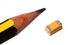
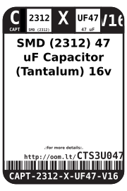
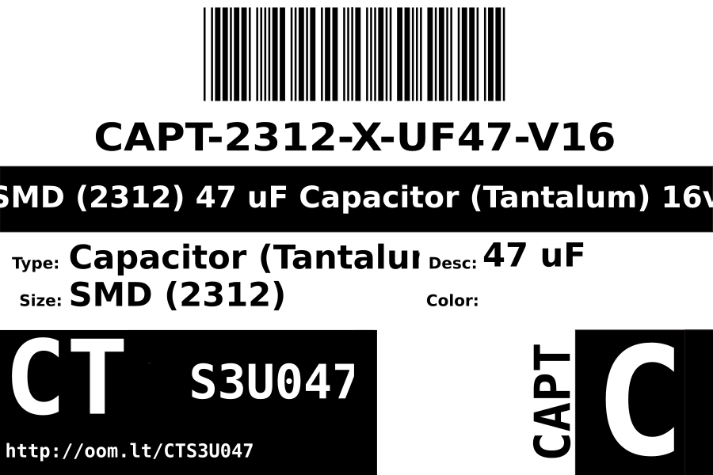

Contents
========

* [CAPT-2312-X-UF47-V16>SMD (2312) 47 uF Capacitor (Tantalum) 16v](#capt-2312-x-uf47-v16smd-2312-47-uf-capacitor-tantalum-16v)
	* [Images](#images)
	* [Datasheets](#datasheets)
	* [Labels](#labels)
	* [EDA](#eda)
		* [Symbols](#symbols)
	* [Tags](#tags)
  
![][im]
# CAPT-2312-X-UF47-V16>SMD (2312) 47 uF Capacitor (Tantalum) 16v

- ID: CAPT-2312-X-UF47-V16
- Name: CAPT-2312-X-UF47-V16

## Images
  
  

|image|image_RE|image_BOTTOM|
| :---: | :---: | :---: |
||||

## Datasheets

- Datasheet: [datasheet.pdf](datasheet.pdf)

## Labels
  
  

|label-front|label-inventory|label-spec|
| :---: | :---: | :---: |
||||

## EDA

### Symbols

## Tags

- oompID: CAPT-2312-X-UF47-V16
- name: SMD (2312) 47 uF Capacitor (Tantalum) 16v
- hexID: CTS3U047
- oompSort: 
- oompType: CAPT
- oompSize: 2312
- oompColor: X
- oompDesc: UF47
- oompIndex: V16
- oompVersion: 99
- oompClass: Surface Mount
- oompClassCode: SMDS
- ooWidth: 0.8 mm
- ooLength: 1.6 mm
- ooNumPins: 2
- oompSchem: template;CAPT-XXXX-X-XXXX-XX-schem
- ooDesignator: C1

[im]: image_600.jpg
