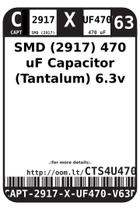
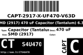
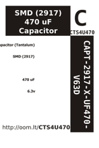

Contents
========

* [CTS4U470 > SMD (2917) 470 uF Capacitor (Tantalum) 6.3v](#cts4u470--smd-2917-470-uf-capacitor-tantalum-63v)
	* [Datasheets](#datasheets)
	* [Labels](#labels)
	* [EDA](#eda)
	* [Images](#images)
	* [Tags](#tags)

# CTS4U470 > SMD (2917) 470 uF Capacitor (Tantalum) 6.3v

- ID: CAPT-2917-X-UF470-V63D
- Hex ID: CTS4U470
- Name: SMD (2917) 470 uF Capacitor (Tantalum) 6.3v
- Description: SMD (2917) 470 uF Capacitor (Tantalum) 6.3v
- Long Link: [http://oom.lt/CAPT-2917-X-UF470-V63D](http://oom.lt/CAPT-2917-X-UF470-V63D)
- Long Link: [http://oom.lt/CTS4U470](http://oom.lt/CTS4U470)

## Datasheets

- Datasheet: [datasheet.pdf](datasheet.pdf)

## Labels
  
  

|label-front|label-inventory|label-spec|
| :---: | :---: | :---: |
||||

## EDA

### Symbols

## Images
  
  

|label-front|label-inventory|label-spec|
| :---: | :---: | :---: |
||||

## Tags

- oompID: CAPT-2917-X-UF470-V63D
- name: SMD (2917) 470 uF Capacitor (Tantalum) 6.3v
- hexID: CTS4U470
- oompSort: CAPT2917UF470
- oompType: CAPT
- oompSize: 2917
- oompColor: X
- oompDesc: UF470
- oompIndex: V63D
- oompVersion: 98
- oompSchem: template;CAPT-XXXX-X-XXXX-XX-schem
- ooDesignator: C1
