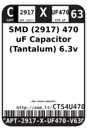
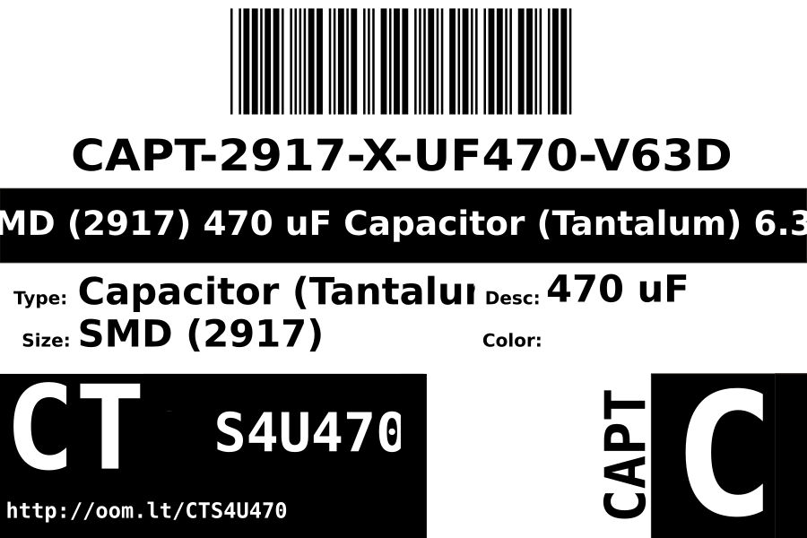

Contents
========

* [CAPT-2917-X-UF470-V63D>SMD (2917) 470 uF Capacitor (Tantalum) 6.3v](#capt-2917-x-uf470-v63dsmd-2917-470-uf-capacitor-tantalum-63v)
	* [Datasheets](#datasheets)
	* [Labels](#labels)
	* [EDA](#eda)
		* [Symbols](#symbols)
	* [Tags](#tags)

# CAPT-2917-X-UF470-V63D>SMD (2917) 470 uF Capacitor (Tantalum) 6.3v

- ID: CAPT-2917-X-UF470-V63D
- Name: CAPT-2917-X-UF470-V63D

## Datasheets

- Datasheet: [datasheet.pdf](datasheet.pdf)

## Labels
  
  

|Front|Inventory|Specifications|
| :---: | :---: | :---: |
||||

## EDA

### Symbols

## Tags

- index: 12423
- oompID: CAPT-2917-X-UF470-V63D
- name: SMD (2917) 470 uF Capacitor (Tantalum) 6.3v
- hexID: CTS4U470
- oompSort: CAPT2917UF470
- oompType: CAPT
- oompSize: 2917
- oompColor: X
- oompDesc: UF470
- oompIndex: V63D
- oompVersion: 98
- oompSchem: template;CAPT-XXXX-X-XXXX-XX-schem
- ooDesignator: C1
