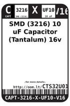
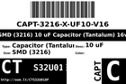
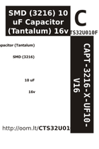
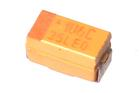
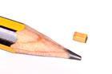
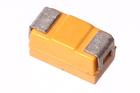

Contents
========

* [CTS32U010F > SMD (3216) 10 uF Capacitor (Tantalum) 16v](#cts32u010f--smd-3216-10-uf-capacitor-tantalum-16v)
	* [Datasheets](#datasheets)
	* [Labels](#labels)
	* [EDA](#eda)
	* [Images](#images)
	* [Tags](#tags)
  
![][im]
# CTS32U010F > SMD (3216) 10 uF Capacitor (Tantalum) 16v

- ID: CAPT-3216-X-UF10-V16
- Hex ID: CTS32U010F
- Name: SMD (3216) 10 uF Capacitor (Tantalum) 16v
- Description: SMD (3216) 10 uF Capacitor (Tantalum) 16v
- Long Link: [http://oom.lt/CAPT-3216-X-UF10-V16](http://oom.lt/CAPT-3216-X-UF10-V16)
- Short Link: [http://oom.lt/CTS32U010F](http://oom.lt/CTS32U010F)

## Datasheets

- Datasheet: [datasheet.pdf](datasheet.pdf)

## Labels
  
  

|label-front|label-inventory|label-spec|
| :---: | :---: | :---: |
||||

## EDA

## Images
  
  

|image|image_RE|image_BOTTOM|label-front|label-inventory|label-spec|
| :---: | :---: | :---: | :---: | :---: | :---: |
|||||||

## Tags

- hexID: CTS32U010F
- oompType: CAPT
- oompSize: 3216
- oompColor: X
- oompDesc: UF10
- oompIndex: V16
- oompVersion: 99
- oompClass: Surface Mount
- oompClassCode: SMDS
- oompBbls: template;XXXX-3216-X-XXXX-XX-bbls
- oompDiag: template;XXXX-3216-X-XXXX-XX-diag
- oompIden: template;XXXX-3216-X-XXXX-XX-iden
- oompSchem: template;CAPT-XXXX-X-XXXX-XX-schem
- oompSimp: template;XXXX-3216-X-XXXX-XX-simp
- ooDesignator: C1
- oompID: CAPT-3216-X-UF10-V16

[im]: image_450.jpg
