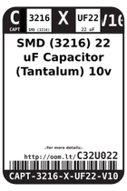
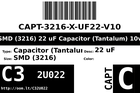
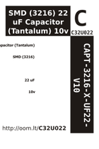

Contents
========

* [C32U022 > ](#c32u022--)
	* [Datasheets](#datasheets)
	* [Labels](#labels)
	* [EDA](#eda)
	* [Images](#images)
	* [Tags](#tags)

# C32U022 > 

- ID: CAPT-3216-X-UF22-V10
- Hex ID: C32U022
- Name: 
- Description: 
- Long Link: [http://oom.lt/CAPT-3216-X-UF22-V10](http://oom.lt/CAPT-3216-X-UF22-V10)
- Short Link: [http://oom.lt/C32U022](http://oom.lt/C32U022)

## Datasheets

- Datasheet: [datasheet.pdf](datasheet.pdf)

## Labels
  
  

|label-front|label-inventory|label-spec|
| :---: | :---: | :---: |
||||

## EDA

## Images
  
  

|label-front|label-inventory|label-spec|
| :---: | :---: | :---: |
||||

## Tags

- hexID: C32U022
- oompType: CAPT
- oompSize: 3216
- oompColor: X
- oompDesc: UF22
- oompIndex: V10
- oompVersion: 98
- oompBbls: template;XXXX-3216-X-XXXX-XX-bbls
- oompDiag: template;XXXX-3216-X-XXXX-XX-diag
- oompIden: template;XXXX-3216-X-XXXX-XX-iden
- oompSchem: template;CAPT-XXXX-X-XXXX-XX-schem
- oompSimp: template;XXXX-3216-X-XXXX-XX-simp
- ooDesignator: C1
- oompID: CAPT-3216-X-UF22-V10
