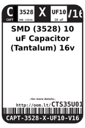
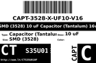
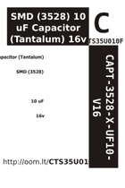
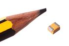
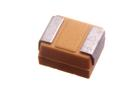

Contents
========

* [CTS35U010F > ](#cts35u010f--)
	* [Datasheets](#datasheets)
	* [Labels](#labels)
	* [EDA](#eda)
	* [Images](#images)
	* [Tags](#tags)
  
![][im]
# CTS35U010F > 

- ID: CAPT-3528-X-UF10-V16
- Hex ID: CTS35U010F
- Name: 
- Description: 
- Long Link: [http://oom.lt/CAPT-3528-X-UF10-V16](http://oom.lt/CAPT-3528-X-UF10-V16)
- Short Link: [http://oom.lt/CTS35U010F](http://oom.lt/CTS35U010F)

## Datasheets

- Datasheet: [datasheet.pdf](datasheet.pdf)

## Labels
  
  

|label-front|label-inventory|label-spec|
| :---: | :---: | :---: |
||||

## EDA

## Images
  
  

|image|image_RE|image_BOTTOM|label-front|label-inventory|label-spec|
| :---: | :---: | :---: | :---: | :---: | :---: |
|||||||

## Tags

- hexID: CTS35U010F
- oompType: CAPT
- oompSize: 3528
- oompColor: X
- oompDesc: UF10
- oompIndex: V16
- oompVersion: 99
- ooNumPins: 2
- oompClass: Surface Mount
- oompClassCode: SMDS
- oompSchem: template;CAPT-XXXX-X-XXXX-XX-schem
- ooDesignator: C1
- oompID: CAPT-3528-X-UF10-V16

[im]: image_450.jpg
