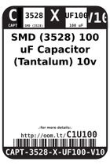
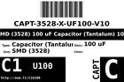
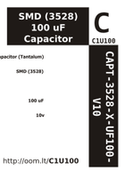

Contents
========

* [C1U100 > ](#c1u100--)
	* [Datasheets](#datasheets)
	* [Labels](#labels)
	* [EDA](#eda)
	* [Images](#images)
	* [Tags](#tags)

# C1U100 > 

- ID: CAPT-3528-X-UF100-V10
- Hex ID: C1U100
- Name: 
- Description: 
- Long Link: [http://oom.lt/CAPT-3528-X-UF100-V10](http://oom.lt/CAPT-3528-X-UF100-V10)
- Short Link: [http://oom.lt/C1U100](http://oom.lt/C1U100)

## Datasheets

- Datasheet: [datasheet.pdf](datasheet.pdf)

## Labels
  
  

|label-front|label-inventory|label-spec|
| :---: | :---: | :---: |
||||

## EDA

## Images
  
  

|label-front|label-inventory|label-spec|
| :---: | :---: | :---: |
||||

## Tags

- hexID: C1U100
- oompSort: CAPT2810UF100
- oompType: CAPT
- oompSize: 3528
- oompColor: X
- oompDesc: UF100
- oompIndex: V10
- oompVersion: 98
- oompSchem: template;CAPT-XXXX-X-XXXX-XX-schem
- ooDesignator: C1
- oompID: CAPT-3528-X-UF100-V10
