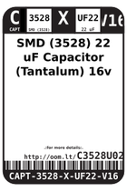
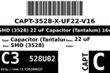
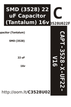

Contents
========

* [C3528U022F > SMD (3528) 22 uF Capacitor (Tantalum) 16v](#c3528u022f--smd-3528-22-uf-capacitor-tantalum-16v)
	* [Datasheets](#datasheets)
	* [Labels](#labels)
	* [EDA](#eda)
	* [Images](#images)
	* [Tags](#tags)

# C3528U022F > SMD (3528) 22 uF Capacitor (Tantalum) 16v

- ID: CAPT-3528-X-UF22-V16
- Hex ID: C3528U022F
- Name: SMD (3528) 22 uF Capacitor (Tantalum) 16v
- Description: SMD (3528) 22 uF Capacitor (Tantalum) 16v
- Long Link: [http://oom.lt/CAPT-3528-X-UF22-V16](http://oom.lt/CAPT-3528-X-UF22-V16)
- Short Link: [http://oom.lt/C3528U022F](http://oom.lt/C3528U022F)

## Datasheets

- Datasheet: [datasheet.pdf](datasheet.pdf)

## Labels
  
  

|label-front|label-inventory|label-spec|
| :---: | :---: | :---: |
||||

## EDA

### Symbols

## Images
  
  

|label-front|label-inventory|label-spec|
| :---: | :---: | :---: |
||||

## Tags

- hexID: C3528U022F
- oompSort: CAPT3528UF22
- oompType: CAPT
- oompSize: 3528
- oompColor: X
- oompDesc: UF22
- oompIndex: V16
- oompVersion: 98
- oompSchem: template;CAPT-XXXX-X-XXXX-XX-schem
- ooDesignator: C1
- oompID: CAPT-3528-X-UF22-V16
