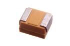

Contents
========

* [CTS3528U047 > SMD (3528) 47 uF Capacitor (Tantalum) 10v](#cts3528u047--smd-3528-47-uf-capacitor-tantalum-10v)
	* [Datasheets](#datasheets)
	* [EDA](#eda)
	* [Images](#images)
	* [Tags](#tags)
  
![][im]
# CTS3528U047 > SMD (3528) 47 uF Capacitor (Tantalum) 10v

- ID: CAPT-3528-X-UF47-V10
- Hex ID: CTS3528U047
- Name: SMD (3528) 47 uF Capacitor (Tantalum) 10v
- Description: SMD (3528) 47 uF Capacitor (Tantalum) 10v
- Long Link: [http://oom.lt/CAPT-3528-X-UF47-V10](http://oom.lt/CAPT-3528-X-UF47-V10)
- Short Link: [http://oom.lt/CTS3528U047](http://oom.lt/CTS3528U047)

## Datasheets

- Datasheet: [datasheet.pdf](datasheet.pdf)

## EDA

### Symbols

## Images
  
  

|image|image_RE|image_BOTTOM|
| :---: | :---: | :---: |
||||

## Tags

- hexID: CTS3528U047
- oompType: CAPT
- oompSize: 3528
- oompColor: X
- oompDesc: UF47
- oompIndex: V10
- oompVersion: 99
- ooWidth: 2.80 mm
- ooLength: 3.50 mm
- ooManufacturer: AVX
- ooManufacturerPartNumber: TAJB476K010RNJ
- ooMaxVoltage: 10 V
- ooTolerance: 10%
- ooSEEEDsku: 0130180P1
- ooSEEEDdesc: SMD CAP Tantalum 47uF-10V 10%
- oompClass: Surface Mount
- oompClassCode: SMDS
- oompSchem: template;CAPT-XXXX-X-XXXX-XX-schem
- ooDesignator: C1
- oompID: CAPT-3528-X-UF47-V10

[im]: image_450.jpg
