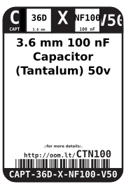
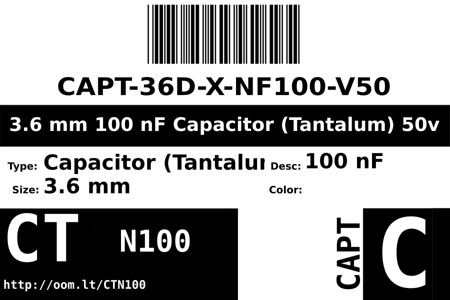

Contents
========

* [CAPT-36D-X-NF100-V50>3.6 mm 100 nF Capacitor (Tantalum) 50v](#capt-36d-x-nf100-v5036-mm-100-nf-capacitor-tantalum-50v)
	* [Images](#images)
	* [Datasheets](#datasheets)
	* [Labels](#labels)
	* [EDA](#eda)
		* [Symbols](#symbols)
	* [Tags](#tags)
  
![][im]
# CAPT-36D-X-NF100-V50>3.6 mm 100 nF Capacitor (Tantalum) 50v

- ID: CAPT-36D-X-NF100-V50
- Name: CAPT-36D-X-NF100-V50

## Images
  
  

|Main|Reference|
| :---: | :---: |
|||

## Datasheets

- Datasheet: [datasheet.pdf](datasheet.pdf)

## Labels
  
  

|Front|Inventory|Specifications|
| :---: | :---: | :---: |
||||

## EDA

### Symbols

## Tags

- oompID: CAPT-36D-X-NF100-V50
- name: 3.6 mm 100 nF Capacitor (Tantalum) 50v
- hexID: CTN100
- oompSort: THTH0.00000010000000
- oompType: CAPT
- oompSize: 36D
- oompColor: X
- oompDesc: NF100
- oompIndex: V50
- oompVersion: 99
- ooPitch: 2.5 mm
- ooWidth: 4 mm
- ooHeight: 4 mm
- ooDepth: 2.6 mm
- ooNumPins: 2
- ooMaxVoltage: 50 V
- ooTolerance: 10 %
- oompClass: Through Hole Component
- oompClassCode: THTH
- oompSchem: template;CAPT-XXXX-X-XXXX-XX-schem
- ooDesignator: C1

[im]: image_600.jpg
