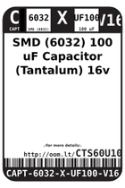
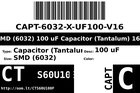
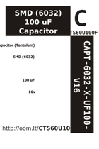

Contents
========

* [CTS60U100F > ](#cts60u100f--)
	* [Datasheets](#datasheets)
	* [Labels](#labels)
	* [EDA](#eda)
	* [Images](#images)
	* [Tags](#tags)

# CTS60U100F > 

- ID: CAPT-6032-X-UF100-V16
- Hex ID: CTS60U100F
- Name: 
- Description: 
- Long Link: [http://oom.lt/CAPT-6032-X-UF100-V16](http://oom.lt/CAPT-6032-X-UF100-V16)
- Short Link: [http://oom.lt/CTS60U100F](http://oom.lt/CTS60U100F)

## Datasheets

- Datasheet: [datasheet.pdf](datasheet.pdf)

## Labels
  
  

|label-front|label-inventory|label-spec|
| :---: | :---: | :---: |
||||

## EDA

## Images
  
  

|label-front|label-inventory|label-spec|
| :---: | :---: | :---: |
||||

## Tags

- hexID: CTS60U100F
- oompSort: CAPC6032UF100
- oompType: CAPT
- oompSize: 6032
- oompColor: X
- oompDesc: UF100
- oompIndex: V16
- oompVersion: 98
- oompSchem: template;CAPT-XXXX-X-XXXX-XX-schem
- ooDesignator: C1
- oompID: CAPT-6032-X-UF100-V16
