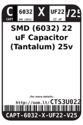
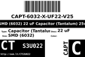
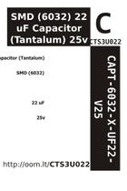
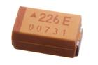
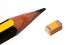

Contents
========

* [CTS3U022 > SMD (6032) 22 uF Capacitor (Tantalum) 25v](#cts3u022--smd-6032-22-uf-capacitor-tantalum-25v)
	* [Datasheets](#datasheets)
	* [Labels](#labels)
	* [EDA](#eda)
	* [Images](#images)
	* [Tags](#tags)
  
![][im]
# CTS3U022 > SMD (6032) 22 uF Capacitor (Tantalum) 25v

- ID: CAPT-6032-X-UF22-V25
- Hex ID: CTS3U022
- Name: SMD (6032) 22 uF Capacitor (Tantalum) 25v
- Description: SMD (6032) 22 uF Capacitor (Tantalum) 25v
- Long Link: [http://oom.lt/CAPT-6032-X-UF22-V25](http://oom.lt/CAPT-6032-X-UF22-V25)
- Short Link: [http://oom.lt/CTS3U022](http://oom.lt/CTS3U022)

## Datasheets

- Datasheet: [datasheet.pdf](datasheet.pdf)

## Labels
  
  

|label-front|label-inventory|label-spec|
| :---: | :---: | :---: |
||||

## EDA

### Symbols

## Images
  
  

|image|image_RE|image_BOTTOM|label-front|label-inventory|label-spec|
| :---: | :---: | :---: | :---: | :---: | :---: |
|||||||

## Tags

- hexID: CTS3U022
- oompType: CAPT
- oompSize: 6032
- oompColor: X
- oompDesc: UF22
- oompIndex: V25
- oompVersion: 99
- ooWidth: 3.20 mm
- ooLength: 6.00 mm
- ooManufacturer: AVX
- ooManufacturerPartNumber: TAJC226K025RNJ
- ooMaxVoltage: 25V
- ooTolerance: 10%
- ooSEEEDsku: 0130360P1
- ooSEEEDdesc: SMD CAP Tantalum 22uF-25V 10% 6032
- oompClass: Surface Mount
- oompClassCode: SMDS
- oompSchem: template;CAPT-XXXX-X-XXXX-XX-schem
- ooDesignator: C1
- oompID: CAPT-6032-X-UF22-V25

[im]: image_450.jpg
