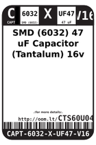
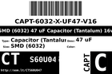
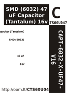
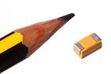
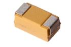

Contents
========

* [CTS60U047 > SMD (6032) 47 uF Capacitor (Tantalum) 16v](#cts60u047--smd-6032-47-uf-capacitor-tantalum-16v)
	* [Datasheets](#datasheets)
	* [Labels](#labels)
	* [EDA](#eda)
	* [Images](#images)
	* [Tags](#tags)
  
![][im]
# CTS60U047 > SMD (6032) 47 uF Capacitor (Tantalum) 16v

- ID: CAPT-6032-X-UF47-V16
- Hex ID: CTS60U047
- Name: SMD (6032) 47 uF Capacitor (Tantalum) 16v
- Description: SMD (6032) 47 uF Capacitor (Tantalum) 16v
- Long Link: [http://oom.lt/CAPT-6032-X-UF47-V16](http://oom.lt/CAPT-6032-X-UF47-V16)
- Short Link: [http://oom.lt/CTS60U047](http://oom.lt/CTS60U047)

## Datasheets

- Datasheet: [datasheet.pdf](datasheet.pdf)

## Labels
  
  

|label-front|label-inventory|label-spec|
| :---: | :---: | :---: |
||||

## EDA

### Symbols

## Images
  
  

|image|image_RE|image_BOTTOM|label-front|label-inventory|label-spec|
| :---: | :---: | :---: | :---: | :---: | :---: |
|||||||

## Tags

- hexID: CTS60U047
- oompType: CAPT
- oompSize: 6032
- oompColor: X
- oompDesc: UF47
- oompIndex: V16
- oompVersion: 99
- oompClass: Surface Mount
- oompClassCode: SMDS
- ooWidth: 0.8 mm
- ooLength: 1.6 mm
- ooNumPins: 2
- oompSchem: template;CAPT-XXXX-X-XXXX-XX-schem
- ooDesignator: C1
- oompID: CAPT-6032-X-UF47-V16

[im]: image_450.jpg
