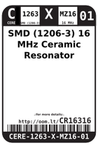
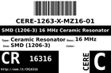

Contents
========

* [CR16316 > SMD (1206-3) 16 MHz Ceramic Resonator](#cr16316--smd-1206-3-16-mhz-ceramic-resonator)
	* [Datasheets](#datasheets)
	* [Labels](#labels)
	* [EDA](#eda)
	* [Images](#images)
	* [Tags](#tags)
  
![][im]
# CR16316 > SMD (1206-3) 16 MHz Ceramic Resonator

- ID: CERE-1263-X-MZ16-01
- Hex ID: CR16316
- Name: SMD (1206-3) 16 MHz Ceramic Resonator
- Description: SMD (1206-3) 16 MHz Ceramic Resonator
- Long Link: [http://oom.lt/CERE-1263-X-MZ16-01](http://oom.lt/CERE-1263-X-MZ16-01)
- Short Link: [http://oom.lt/CR16316](http://oom.lt/CR16316)

## Datasheets

- Datasheet: [datasheet.pdf](datasheet.pdf)

## Labels
  
  

|label-front|label-inventory|label-spec|
| :---: | :---: | :---: |
||||

## EDA

### Symbols

## Images
  
  

|image|image_RE|label-front|label-inventory|label-spec|
| :---: | :---: | :---: | :---: | :---: |
||||||

## Tags

- oompID: CERE-1263-X-MZ16-01
- name: SMD (1206-3) 16 MHz Ceramic Resonator
- hexID: CR16316
- oompSort: 120616000000
- oompType: CERE
- oompSize: 1263
- oompColor: X
- oompDesc: MZ16
- oompIndex: 01
- oompVersion: 99
- oompSkip: true
- ooWidth: 3.2 mm
- ooHeight: 0.9 mm
- ooLength: 1.3 mm
- ooNumPins: 3
- oompClass: Surface Mount
- oompClassCode: SMDS
- oompSchem: template;CERE-XXXX-X-XXXX-XX-schem
- ooDesignator: X1

[im]: image_450.jpg
