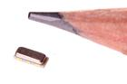
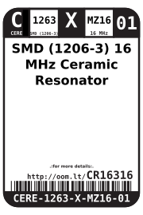
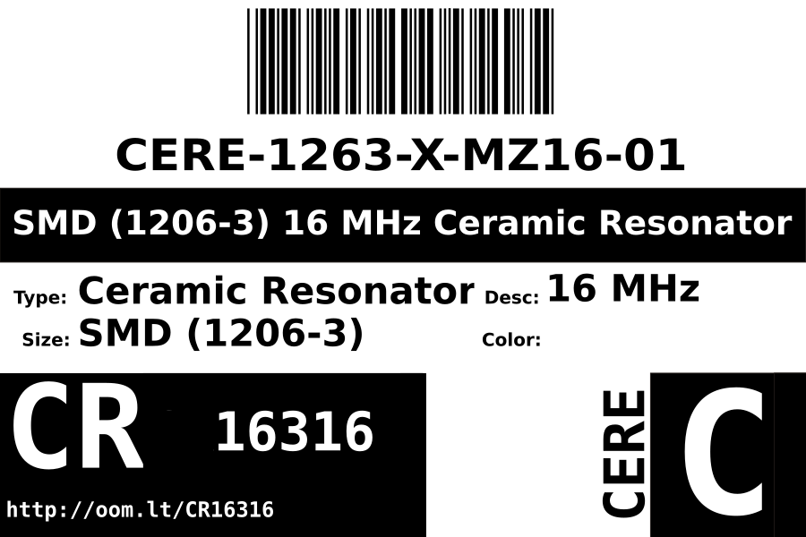
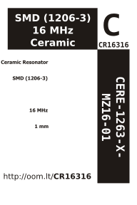

Contents
========

* [CERE-1263-X-MZ16-01>SMD (1206-3) 16 MHz Ceramic Resonator](#cere-1263-x-mz16-01smd-1206-3-16-mhz-ceramic-resonator)
	* [Images](#images)
	* [Datasheets](#datasheets)
	* [Labels](#labels)
	* [EDA](#eda)
		* [Symbols](#symbols)
	* [Tags](#tags)
  
![][im]
# CERE-1263-X-MZ16-01>SMD (1206-3) 16 MHz Ceramic Resonator

- ID: CERE-1263-X-MZ16-01
- Name: CERE-1263-X-MZ16-01

## Images
  
  

|image|image_RE|
| :---: | :---: |
|||

## Datasheets

- Datasheet: [datasheet.pdf](datasheet.pdf)

## Labels
  
  

|label-front|label-inventory|label-spec|
| :---: | :---: | :---: |
||||

## EDA

### Symbols

## Tags

- oompID: CERE-1263-X-MZ16-01
- name: SMD (1206-3) 16 MHz Ceramic Resonator
- hexID: CR16316
- oompSort: 120616000000
- oompType: CERE
- oompSize: 1263
- oompColor: X
- oompDesc: MZ16
- oompIndex: 01
- oompVersion: 99
- oompSkip: true
- ooWidth: 3.2 mm
- ooHeight: 0.9 mm
- ooLength: 1.3 mm
- ooNumPins: 3
- oompClass: Surface Mount
- oompClassCode: SMDS
- oompSchem: template;CERE-XXXX-X-XXXX-XX-schem
- ooDesignator: X1

[im]: image_600.jpg
