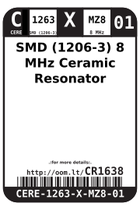
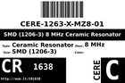
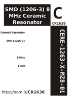

Contents
========

* [CR1638 > SMD (1206-3) 8 MHz Ceramic Resonator](#cr1638--smd-1206-3-8-mhz-ceramic-resonator)
	* [Images](#images)
	* [Datasheets](#datasheets)
	* [Labels](#labels)
	* [EDA](#eda)
	* [Tags](#tags)

# CR1638 > SMD (1206-3) 8 MHz Ceramic Resonator

- ID: CERE-1263-X-MZ8-01
- Hex ID: CR1638
- Name: SMD (1206-3) 8 MHz Ceramic Resonator
- Description: SMD (1206-3) 8 MHz Ceramic Resonator

## Images
  
  

|label-front|label-inventory|label-spec|
| :---: | :---: | :---: |
||||

## Datasheets

- Datasheet: [datasheet.pdf](datasheet.pdf)

## Labels
  
  

|label-front|label-inventory|label-spec|
| :---: | :---: | :---: |
||||

## EDA

### Symbols

## Tags

- oompID: CERE-1263-X-MZ8-01
- name: SMD (1206-3) 8 MHz Ceramic Resonator
- hexID: CR1638
- oompSort: CERE1263MZ8
- oompType: CERE
- oompSize: 1263
- oompColor: X
- oompDesc: MZ8
- oompIndex: 01
- oompVersion: 98
- oompSchem: template;CERE-XXXX-X-XXXX-XX-schem
- ooDesignator: X1
