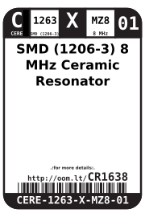

Contents
========

* [CERE-1263-X-MZ8-01>SMD (1206-3) 8 MHz Ceramic Resonator](#cere-1263-x-mz8-01smd-1206-3-8-mhz-ceramic-resonator)
	* [Datasheets](#datasheets)
	* [Labels](#labels)
	* [EDA](#eda)
		* [Symbols](#symbols)
	* [Tags](#tags)

# CERE-1263-X-MZ8-01>SMD (1206-3) 8 MHz Ceramic Resonator

- ID: CERE-1263-X-MZ8-01
- Name: CERE-1263-X-MZ8-01

## Datasheets

- Datasheet: [datasheet.pdf](datasheet.pdf)

## Labels
  
  

|Front|Inventory|Specifications|
| :---: | :---: | :---: |
||||

## EDA

### Symbols

## Tags

- index: 128
- oompID: CERE-1263-X-MZ8-01
- name: SMD (1206-3) 8 MHz Ceramic Resonator
- hexID: CR1638
- oompSort: CERE1263MZ8
- oompType: CERE
- oompSize: 1263
- oompColor: X
- oompDesc: MZ8
- oompIndex: 01
- oompVersion: 98
- oompSchem: template;CERE-XXXX-X-XXXX-XX-schem
- ooDesignator: X1
