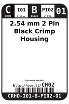
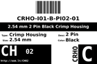
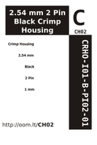

Contents
========

* [CH02 > 2.54 mm 2 Pin Black Crimp Housing](#ch02--254-mm-2-pin-black-crimp-housing)
	* [Images](#images)
	* [Datasheets](#datasheets)
	* [Labels](#labels)
	* [EDA](#eda)
	* [Tags](#tags)
  
![][im]
# CH02 > 2.54 mm 2 Pin Black Crimp Housing

- ID: CRHO-I01-B-PI02-01
- Hex ID: CH02
- Name: 2.54 mm 2 Pin Black Crimp Housing
- Description: 2.54 mm 2 Pin Black Crimp Housing

## Images
  
  

|image|image_RE|label-front|label-inventory|label-spec|
| :---: | :---: | :---: | :---: | :---: |
||||||

## Datasheets

- Datasheet: [datasheet.pdf](datasheet.pdf)

## Labels
  
  

|label-front|label-inventory|label-spec|
| :---: | :---: | :---: |
||||

## EDA

### Symbols

## Tags

- oompID: CRHO-I01-B-PI02-01
- name: 2.54 mm 2 Pin Black Crimp Housing
- hexID: CH02
- oompSort: 010102
- oompType: CRHO
- oompSize: I01
- oompColor: B
- oompDesc: PI02
- oompIndex: 01
- oompVersion: 10
- ooPitch: 2.54 mm
- ooWidth: 5.28 mm
- ooHeight: 14 mm
- ooDepth: 2.5 mm
- ooMaterial: Plastic
- ooTerminalStyle: DuPont
- ooMaxCurrent: 3 A
- ooMaxVoltage: 250 V
- oompAbout: This two pin housing is most often used for connecting power to a project. When doing this it&#39s best to use the convention of red for positive, and black for ground. Another common usage is when connecting an externally mounted button.
- oompClass: Through Hole Component
- oompClassCode: THTH
- oompBbls: variable;clear
- oompBbls: variable;pins;2
- oompBbls: template;XXXX-I01-X-XX-01-bbls
- oompDiag: variable;clear
- oompDiag: variable;pins;2
- oompDiag: template;CRHO-I01-X-XX-01-diag
- drawItem: variable;clear
- drawItem: variable;pins;2
- drawItem: template;XXXX-I01-X-XX-01-iden
- oompSchem: variable;clear
- oompSchem: variable;pins;2
- oompSchem: template;XXXX-XX-X-XX-01-PINS-EVEN-schem
- oompSimp: variable;clear
- oompSimp: variable;pins;2
- oompSimp: template;XXXX-I01-X-XX-01-simp
- ooDesignator: J1

[im]: image_450.jpg
