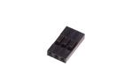

Contents
========

* [CH03 > 2.54 mm 3 Pin Black Crimp Housing](#ch03--254-mm-3-pin-black-crimp-housing)
	* [Datasheets](#datasheets)
	* [Labels](#labels)
	* [EDA](#eda)
	* [Images](#images)
	* [Tags](#tags)
  
![][im]
# CH03 > 2.54 mm 3 Pin Black Crimp Housing

- ID: CRHO-I01-B-PI03-01
- Hex ID: CH03
- Name: 2.54 mm 3 Pin Black Crimp Housing
- Description: 2.54 mm 3 Pin Black Crimp Housing
- Long Link: [http://oom.lt/CRHO-I01-B-PI03-01](http://oom.lt/CRHO-I01-B-PI03-01)
- Short Link: [http://oom.lt/CH03](http://oom.lt/CH03)

## Datasheets

- Datasheet: [datasheet.pdf](datasheet.pdf)

## Labels
  
  

|label-front|label-inventory|label-spec|
| :---: | :---: | :---: |
||||

## EDA

### Symbols

## Images
  
  

|image|image_RE|label-front|label-inventory|label-spec|
| :---: | :---: | :---: | :---: | :---: |
||||||

## Tags

- oompID: CRHO-I01-B-PI03-01
- name: 2.54 mm 3 Pin Black Crimp Housing
- hexID: CH03
- oompSort: 010103
- oompType: CRHO
- oompSize: I01
- oompColor: B
- oompDesc: PI03
- oompIndex: 01
- oompVersion: 10
- ooPitch: 2.54 mm
- ooWidth: 7.82 mm
- ooHeight: 14 mm
- ooDepth: 2.5 mm
- ooMaterial: Plastic
- ooTerminalStyle: DuPont
- ooMaxCurrent: 3 A
- ooMaxVoltage: 250 V
- oompAbout: This three pin housing is great for connecting externally mounted potentiometers. Also commonly found on hobby servos or any item requiring power (+,gnd) and a signal line. (WS2812 LED strings, analog temperature sensors etc.)
- oompClass: Through Hole Component
- oompClassCode: THTH
- oompBbls: variable;clear
- oompBbls: variable;pins;3
- oompBbls: template;XXXX-I01-X-XX-01-bbls
- oompDiag: variable;clear
- oompDiag: variable;pins;3
- oompDiag: template;CRHO-I01-X-XX-01-diag
- drawItem: variable;clear
- drawItem: variable;pins;3
- drawItem: template;XXXX-I01-X-XX-01-iden
- oompSchem: variable;clear
- oompSchem: variable;pins;3
- oompSchem: template;XXXX-XX-X-XX-01-PINS-ODD-schem
- oompSimp: variable;clear
- oompSimp: variable;pins;3
- oompSimp: template;XXXX-I01-X-XX-01-simp
- ooDesignator: J1

[im]: image_450.jpg
