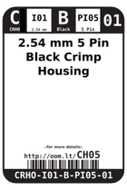
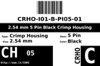

Contents
========

* [CH05 > 2.54 mm 5 Pin Black Crimp Housing](#ch05--254-mm-5-pin-black-crimp-housing)
	* [Datasheets](#datasheets)
	* [Labels](#labels)
	* [EDA](#eda)
	* [Images](#images)
	* [Tags](#tags)
  
![][im]
# CH05 > 2.54 mm 5 Pin Black Crimp Housing

- ID: CRHO-I01-B-PI05-01
- Hex ID: CH05
- Name: 2.54 mm 5 Pin Black Crimp Housing
- Description: 2.54 mm 5 Pin Black Crimp Housing
- Long Link: [http://oom.lt/CRHO-I01-B-PI05-01](http://oom.lt/CRHO-I01-B-PI05-01)
- Short Link: [http://oom.lt/CH05](http://oom.lt/CH05)

## Datasheets

- Datasheet: [datasheet.pdf](datasheet.pdf)

## Labels
  
  

|label-front|label-inventory|label-spec|
| :---: | :---: | :---: |
||||

## EDA

## Images
  
  

|image|image_RE|label-front|label-inventory|label-spec|
| :---: | :---: | :---: | :---: | :---: |
||||||

## Tags

- oompID: CRHO-I01-B-PI05-01
- name: 2.54 mm 5 Pin Black Crimp Housing
- hexID: CH05
- oompSort: 010105
- oompType: CRHO
- oompSize: I01
- oompColor: B
- oompDesc: PI05
- oompIndex: 01
- oompVersion: 10
- ooPitch: 2.54 mm
- ooWidth: 12.9 mm
- ooHeight: 14 mm
- ooDepth: 2.5 mm
- ooMaterial: Plastic
- ooTerminalStyle: DuPont
- ooMaxCurrent: 3 A
- ooMaxVoltage: 250 V
- oompAbout: These five pin connectors are often used simply when you find you have five wires that need connecting. That said it can occasionally be found connecting an SPI bus (power (+,-), data, clock, slave select (SS)) or on a stepper motor being driven in uni-polar mode, with a shared central tap (A,B,C,D,tap)
- oompClass: Through Hole Component
- oompClassCode: THTH
- oompBbls: variable;clear
- oompBbls: variable;pins;5
- oompBbls: template;XXXX-I01-X-XX-01-bbls
- oompDiag: variable;clear
- oompDiag: variable;pins;5
- oompDiag: template;CRHO-I01-X-XX-01-diag
- drawItem: variable;clear
- drawItem: variable;pins;5
- drawItem: template;XXXX-I01-X-XX-01-iden
- oompSchem: variable;clear
- oompSchem: variable;pins;5
- oompSchem: template;XXXX-XX-X-XX-01-PINS-ODD-schem
- oompSimp: variable;clear
- oompSimp: variable;pins;5
- oompSimp: template;XXXX-I01-X-XX-01-simp
- ooDesignator: J1

[im]: image_450.jpg
