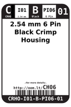
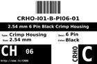
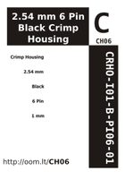
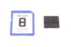

Contents
========

* [CH06 > 2.54 mm 6 Pin Black Crimp Housing](#ch06--254-mm-6-pin-black-crimp-housing)
	* [Datasheets](#datasheets)
	* [Labels](#labels)
	* [EDA](#eda)
	* [Images](#images)
	* [Tags](#tags)
  
![][im]
# CH06 > 2.54 mm 6 Pin Black Crimp Housing

- ID: CRHO-I01-B-PI06-01
- Hex ID: CH06
- Name: 2.54 mm 6 Pin Black Crimp Housing
- Description: 2.54 mm 6 Pin Black Crimp Housing
- Long Link: [http://oom.lt/CRHO-I01-B-PI06-01](http://oom.lt/CRHO-I01-B-PI06-01)
- Long Link: [http://oom.lt/CH06](http://oom.lt/CH06)

## Datasheets

- Datasheet: [datasheet.pdf](datasheet.pdf)

## Labels
  
  

|label-front|label-inventory|label-spec|
| :---: | :---: | :---: |
||||

## EDA

### Symbols

## Images
  
  

|image|image_RE|label-front|label-inventory|label-spec|
| :---: | :---: | :---: | :---: | :---: |
||||||

## Tags

- oompID: CRHO-I01-B-PI06-01
- name: 2.54 mm 6 Pin Black Crimp Housing
- hexID: CH06
- oompSort: 010106
- oompType: CRHO
- oompSize: I01
- oompColor: B
- oompDesc: PI06
- oompIndex: 01
- oompVersion: 10
- ooPitch: 2.54 mm
- ooWidth: 15.44 mm
- ooHeight: 14 mm
- ooDepth: 2.5 mm
- ooMaterial: Plastic
- ooTerminalStyle: DuPont
- ooMaxCurrent: 3 A
- ooMaxVoltage: 250 V
- oompAbout: These six pin connectors are often used simply when you find you have six wires that need connecting. However they can occasionally be found on a stepper motor being driven in uni-polar mode (A,B,ABCom,C,D,CDCom), or are also handy when paired with a ten pin connector to attach a parallel LCD screen to a project.
- oompClass: Through Hole Component
- oompClassCode: THTH

[im]: image_450.jpg
