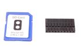
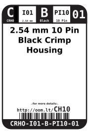
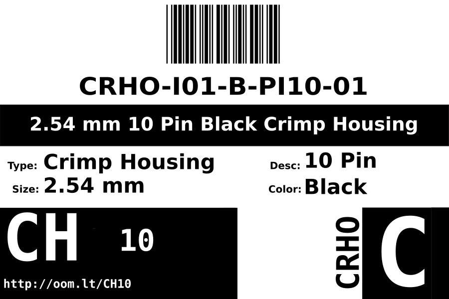
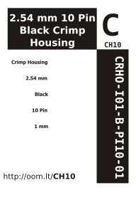

Contents
========

* [CRHO-I01-B-PI10-01>2.54 mm 10 Pin Black Crimp Housing](#crho-i01-b-pi10-01254-mm-10-pin-black-crimp-housing)
	* [Images](#images)
	* [Datasheets](#datasheets)
	* [Labels](#labels)
	* [EDA](#eda)
		* [Symbols](#symbols)
	* [Tags](#tags)
  
![][im]
# CRHO-I01-B-PI10-01>2.54 mm 10 Pin Black Crimp Housing

- ID: CRHO-I01-B-PI10-01
- Name: CRHO-I01-B-PI10-01

## Images
  
  

|image|image_RE|
| :---: | :---: |
|||

## Datasheets

- Datasheet: [datasheet.pdf](datasheet.pdf)

## Labels
  
  

|label-front|label-inventory|label-spec|
| :---: | :---: | :---: |
||||

## EDA

### Symbols

## Tags

- oompID: CRHO-I01-B-PI10-01
- name: 2.54 mm 10 Pin Black Crimp Housing
- hexID: CH10
- oompSort: 010110
- oompType: CRHO
- oompSize: I01
- oompColor: B
- oompDesc: PI10
- oompIndex: 01
- oompVersion: 10
- ooPitch: 2.54 mm
- ooWidth: 25.6 mm
- ooHeight: 14 mm
- ooDepth: 2.5 mm
- ooMaterial: Plastic
- ooTerminalStyle: DuPont
- ooMaxCurrent: 3 A
- ooMaxVoltage: 250 V
- oompAbout: These ten pin connectors are often used simply when you find you have ten wires that need connecting. They are occasionally useful when paired with a six pin header, to connect a parallel LCD to a project.
- oompClass: Through Hole Component
- oompClassCode: THTH
- oompBbls: variable;clear
- oompBbls: variable;pins;10
- oompBbls: template;XXXX-I01-X-XX-01-bbls
- oompDiag: variable;clear
- oompDiag: variable;pins;10
- oompDiag: template;CRHO-I01-X-XX-01-diag
- drawItem: variable;clear
- drawItem: variable;pins;10
- drawItem: template;XXXX-I01-X-XX-01-iden
- oompSchem: variable;clear
- oompSchem: variable;pins;10
- oompSchem: template;XXXX-XX-X-XX-01-PINS-EVEN-schem
- oompSimp: variable;clear
- oompSimp: variable;pins;10
- oompSimp: template;XXXX-I01-X-XX-01-simp
- ooDesignator: J1

[im]: image_600.jpg
