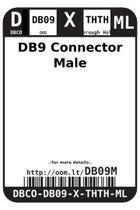
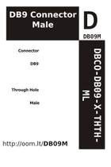

Contents
========

* [DB09M > DB9 Connector Male](#db09m--db9-connector-male)
	* [Images](#images)
	* [Datasheets](#datasheets)
	* [Labels](#labels)
	* [EDA](#eda)
	* [Tags](#tags)
  
![][im]
# DB09M > DB9 Connector Male

- ID: DBCO-DB09-X-THTH-ML
- Hex ID: DB09M
- Name: DB9 Connector Male
- Description: DB9 Connector Male

## Images
  
  

|image|label-front|label-inventory|label-spec|
| :---: | :---: | :---: | :---: |
|||||

## Datasheets

- Datasheet: [datasheet.pdf](datasheet.pdf)

## Labels
  
  

|label-front|label-inventory|label-spec|
| :---: | :---: | :---: |
||||

## EDA

### Symbols

## Tags

- oompID: DBCO-DB09-X-THTH-ML
- name: DB9 Connector Male
- hexID: DB09M
- oompSort: 
- oompClass: Through Hole
- oompClassCode: THTH
- oompType: DBCO
- oompSize: DB09
- oompColor: X
- oompDesc: THTH
- oompIndex: ML
- oompVersion: 40
- ooDesignator: J1

[im]: image_450.jpg
