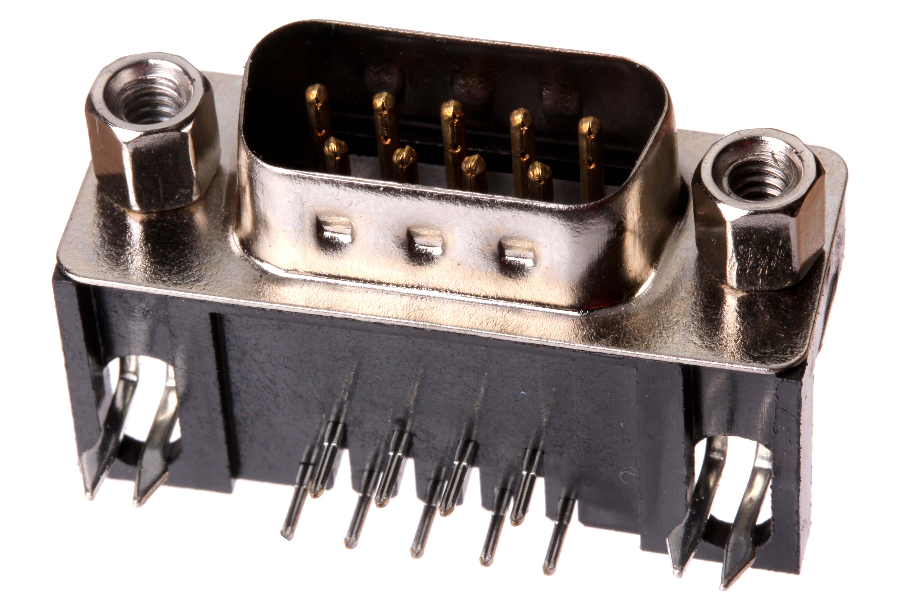

Contents
========

* [DBCO-DB09-X-THTH-ML>DB9 Connector Male](#dbco-db09-x-thth-mldb9-connector-male)
	* [Images](#images)
	* [Datasheets](#datasheets)
	* [EDA](#eda)
		* [Symbols](#symbols)
	* [Tags](#tags)
  
![][im]
# DBCO-DB09-X-THTH-ML>DB9 Connector Male

- ID: DBCO-DB09-X-THTH-ML
- Name: DBCO-DB09-X-THTH-ML

## Images
  
  

|Main|
| :---: |
||

## Datasheets

- Datasheet: [datasheet.pdf](datasheet.pdf)

## EDA

### Symbols

## Tags

- index: 137
- oompID: DBCO-DB09-X-THTH-ML
- name: DB9 Connector Male
- hexID: DB09M
- oompSort: 
- oompClass: Through Hole
- oompClassCode: THTH
- oompType: DBCO
- oompSize: DB09
- oompColor: X
- oompDesc: THTH
- oompIndex: ML
- oompVersion: 40
- ooDesignator: J1

[im]: image_600.jpg
