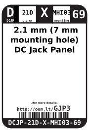
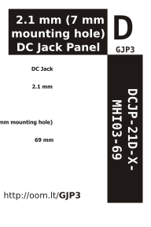

Contents
========

* [DCJP-21D-X-MHI03-69>2.1 mm (7 mm mounting hole) DC Jack Panel Mount](#dcjp-21d-x-mhi03-6921-mm-7-mm-mounting-hole-dc-jack-panel-mount)
	* [Datasheets](#datasheets)
	* [Labels](#labels)
	* [EDA](#eda)
		* [Symbols](#symbols)
	* [Tags](#tags)

# DCJP-21D-X-MHI03-69>2.1 mm (7 mm mounting hole) DC Jack Panel Mount

- ID: DCJP-21D-X-MHI03-69
- Name: DCJP-21D-X-MHI03-69

## Datasheets

- Datasheet: [datasheet.pdf](datasheet.pdf)

## Labels
  
  

|Front|Inventory|Specifications|
| :---: | :---: | :---: |
||||

## EDA

### Symbols

## Tags

- hexID: GJP3
- oompSort: DCJP21DMHI03
- oompType: DCJP
- oompSize: 21D
- oompColor: X
- oompDesc: MHI03
- oompIndex: 69
- oompVersion: 98
- ooPin1: +
- ooPin2: -
- oompBbls: template;DCJP-21D-X-MHI03-69-bbls
- oompDiag: template;DCJP-21D-X-MHI03-69-diag
