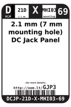
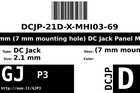
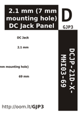

Contents
========

* [GJP3 >  2.1 mm (7 mm mounting hole) DC Jack Panel Mount ](#gjp3---21-mm-7-mm-mounting-hole-dc-jack-panel-mount-)
	* [Datasheets](#datasheets)
	* [Labels](#labels)
	* [EDA](#eda)
	* [Images](#images)
	* [Tags](#tags)

# GJP3 >  2.1 mm (7 mm mounting hole) DC Jack Panel Mount 

- ID: DCJP-21D-X-MHI03-69
- Hex ID: GJP3
- Name:  2.1 mm (7 mm mounting hole) DC Jack Panel Mount 
- Description:  2.1 mm (7 mm mounting hole) DC Jack Panel Mount 
- Long Link: [http://oom.lt/DCJP-21D-X-MHI03-69](http://oom.lt/DCJP-21D-X-MHI03-69)
- Long Link: [http://oom.lt/GJP3](http://oom.lt/GJP3)

## Datasheets

- Datasheet: [datasheet.pdf](datasheet.pdf)

## Labels
  
  

|label-front|label-inventory|label-spec|
| :---: | :---: | :---: |
||||

## EDA

### Symbols

## Images
  
  

|label-front|label-inventory|label-spec|
| :---: | :---: | :---: |
||||

## Tags

- oompID: DCJP-21D-X-MHI03-69
- name:  2.1 mm (7 mm mounting hole) DC Jack Panel Mount 
- hexID: GJP3
- oompSort: DCJP21DMHI03
- oompType: DCJP
- oompSize: 21D
- oompColor: X
- oompDesc: MHI03
- oompIndex: 69
- oompVersion: 98
- ooPin1: +
- ooPin2: -
- oompBbls: template;DCJP-21D-X-MHI03-69-bbls
- oompDiag: template;DCJP-21D-X-MHI03-69-diag
