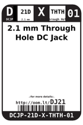
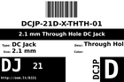
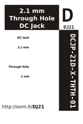
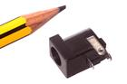

Contents
========

* [DJ21 > 2.1 mm DC Jack](#dj21--21-mm-dc-jack)
	* [Datasheets](#datasheets)
	* [Labels](#labels)
	* [EDA](#eda)
	* [Images](#images)
	* [Tags](#tags)
  
![][im]
# DJ21 > 2.1 mm DC Jack

- ID: DCJP-21D-X-STAN-01
- Hex ID: DJ21
- Name: 2.1 mm DC Jack
- Description: 2.1 mm DC Jack
- Long Link: [http://oom.lt/DCJP-21D-X-STAN-01](http://oom.lt/DCJP-21D-X-STAN-01)
- Short Link: [http://oom.lt/DJ21](http://oom.lt/DJ21)

## Datasheets

- Datasheet: [datasheet.pdf](datasheet.pdf)

## Labels
  
  

|label-front|label-inventory|label-spec|
| :---: | :---: | :---: |
||||

## EDA

### Instances
  
  
Used 18 times.  
Prevalance: (18\9905) 0.1817%  

|OOMP Instances|
| :---: |
|[PROJ-SPAR-10914-STAN-01  Arduino Pro 328  Used 1 times. JP4](https://github.com/oomlout/oomlout_OOMP_projects/tree/main/PROJ-SPAR-10914-STAN-01/)|
|[PROJ-SPAR-10930-STAN-01  ClockIt  Used 1 times. J1](https://github.com/oomlout/oomlout_OOMP_projects/tree/main/PROJ-SPAR-10930-STAN-01/)|
|[PROJ-SPAR-11007-STAN-01  Mega Pro  Used 1 times. J2](https://github.com/oomlout/oomlout_OOMP_projects/tree/main/PROJ-SPAR-11007-STAN-01/)|
|[PROJ-SPAR-11043-STAN-01  fabFM-Kit  Used 1 times. J1](https://github.com/oomlout/oomlout_OOMP_projects/tree/main/PROJ-SPAR-11043-STAN-01/)|
|[PROJ-SPAR-11197-STAN-01  ATmega128RFA1 Dev  Used 1 times. J3](https://github.com/oomlout/oomlout_OOMP_projects/tree/main/PROJ-SPAR-11197-STAN-01/)|
|[PROJ-SPAR-114-STAN-01  Breadboard Power Supply 5V 3.3V  Used 1 times. J1](https://github.com/oomlout/oomlout_OOMP_projects/tree/main/PROJ-SPAR-114-STAN-01/)|
|[PROJ-SPAR-11561-STAN-01  RaspiRobot  Used 1 times. J1](https://github.com/oomlout/oomlout_OOMP_projects/tree/main/PROJ-SPAR-11561-STAN-01/)|
|[PROJ-SPAR-12885-STAN-01  SunnyBuddy  Used 1 times. J2](https://github.com/oomlout/oomlout_OOMP_projects/tree/main/PROJ-SPAR-12885-STAN-01/)|
|[PROJ-SPAR-13124-STAN-01  Proto Pedal  Used 1 times. JP4](https://github.com/oomlout/oomlout_OOMP_projects/tree/main/PROJ-SPAR-13124-STAN-01/)|
|[PROJ-SPAR-13157-STAN-01  Breadboard Power Supply Stick 3.3V-1.8V  Used 1 times. J1](https://github.com/oomlout/oomlout_OOMP_projects/tree/main/PROJ-SPAR-13157-STAN-01/)|
|[PROJ-SPAR-13288-STAN-01  Teensy Arduino Shield Adapter  Used 1 times. JP2](https://github.com/oomlout/oomlout_OOMP_projects/tree/main/PROJ-SPAR-13288-STAN-01/)|
|[PROJ-SPAR-13672-STAN-01  SAMD21 Dev Breakout  Used 1 times. JP3](https://github.com/oomlout/oomlout_OOMP_projects/tree/main/PROJ-SPAR-13672-STAN-01/)|
|[PROJ-SPAR-13714-STAN-01  FreeSoc2  Used 1 times. JP18](https://github.com/oomlout/oomlout_OOMP_projects/tree/main/PROJ-SPAR-13714-STAN-01/)|
|[PROJ-SPAR-13720-STAN-01  MP3 Trigger  Used 1 times. J1](https://github.com/oomlout/oomlout_OOMP_projects/tree/main/PROJ-SPAR-13720-STAN-01/)|
|[PROJ-SPAR-13975-STAN-01  RedBoard  Used 1 times. J3](https://github.com/oomlout/oomlout_OOMP_projects/tree/main/PROJ-SPAR-13975-STAN-01/)|
|[PROJ-SPAR-14155-STAN-01  ESP32 Power Control Shield  Used 1 times. J2](https://github.com/oomlout/oomlout_OOMP_projects/tree/main/PROJ-SPAR-14155-STAN-01/)|
|[PROJ-SPAR-14669-STAN-01  BlackBoard  Used 1 times. J3](https://github.com/oomlout/oomlout_OOMP_projects/tree/main/PROJ-SPAR-14669-STAN-01/)|
|[PROJ-SPAR-14812-STAN-01  RedBoard Turbo  Used 1 times. JP3](https://github.com/oomlout/oomlout_OOMP_projects/tree/main/PROJ-SPAR-14812-STAN-01/)|

### Symbols

## Images
  
  

|image|image_RE|label-front|label-inventory|label-spec|
| :---: | :---: | :---: | :---: | :---: |
||||||

## Tags

- hexID: DJ21
- oompType: DCJP
- oompSize: 21D
- oompColor: X
- oompDesc: STAN
- oompIndex: 01
- oompVersion: 99
- ooWidth: 14.2 mm
- ooHeight: 11 mm
- ooLength: 9 mm
- ooManufacturer: C-BEST
- ooManufacturerPartNumber: DC-005
- ooNumPins: 3
- ooFootprint: OOMP-DCJP-21D-X-STAN-01
- useID: 1
- useID: 1
- importance: 1
- importance: 1
- useTitle: DC Input
- useTitle: Arduino Power
- useDescription: a socket for low voltage DC power.
- useDescription: Used as the power adapter jack on the Arduino UNO
- ooSEEEDsku: 3410020P1
- ooSEEEDdesc: CONN POWER JACK 2.1MM
- oompAbout: A commonly used adapter for connecting DC power to a project. Often reffered to as a barrel jack. It is common (although not always) practice to wire these up centre pin positive.
- ooSEEED3dModel: http://www.seeedstudio.com/wiki/File:PW-3P-2.1.zip
- oompClass: Through Hole Component
- oompClassCode: THTH
- ooDesignator: J1
- oompID: DCJP-21D-X-STAN-01
- oompInstances: {'PROJECT': 'PROJ-SPAR-10914-STAN-01', 'ID': 'JP4'}
- oompInstances: {'PROJECT': 'PROJ-SPAR-10930-STAN-01', 'ID': 'J1'}
- oompInstances: {'PROJECT': 'PROJ-SPAR-11007-STAN-01', 'ID': 'J2'}
- oompInstances: {'PROJECT': 'PROJ-SPAR-11043-STAN-01', 'ID': 'J1'}
- oompInstances: {'PROJECT': 'PROJ-SPAR-11197-STAN-01', 'ID': 'J3'}
- oompInstances: {'PROJECT': 'PROJ-SPAR-114-STAN-01', 'ID': 'J1'}
- oompInstances: {'PROJECT': 'PROJ-SPAR-11561-STAN-01', 'ID': 'J1'}
- oompInstances: {'PROJECT': 'PROJ-SPAR-12885-STAN-01', 'ID': 'J2'}
- oompInstances: {'PROJECT': 'PROJ-SPAR-13124-STAN-01', 'ID': 'JP4'}
- oompInstances: {'PROJECT': 'PROJ-SPAR-13157-STAN-01', 'ID': 'J1'}
- oompInstances: {'PROJECT': 'PROJ-SPAR-13288-STAN-01', 'ID': 'JP2'}
- oompInstances: {'PROJECT': 'PROJ-SPAR-13672-STAN-01', 'ID': 'JP3'}
- oompInstances: {'PROJECT': 'PROJ-SPAR-13714-STAN-01', 'ID': 'JP18'}
- oompInstances: {'PROJECT': 'PROJ-SPAR-13720-STAN-01', 'ID': 'J1'}
- oompInstances: {'PROJECT': 'PROJ-SPAR-13975-STAN-01', 'ID': 'J3'}
- oompInstances: {'PROJECT': 'PROJ-SPAR-14155-STAN-01', 'ID': 'J2'}
- oompInstances: {'PROJECT': 'PROJ-SPAR-14669-STAN-01', 'ID': 'J3'}
- oompInstances: {'PROJECT': 'PROJ-SPAR-14812-STAN-01', 'ID': 'JP3'}

[im]: image_450.jpg
